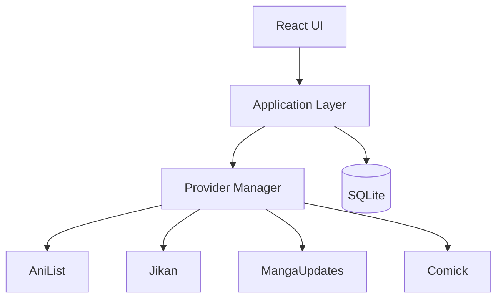
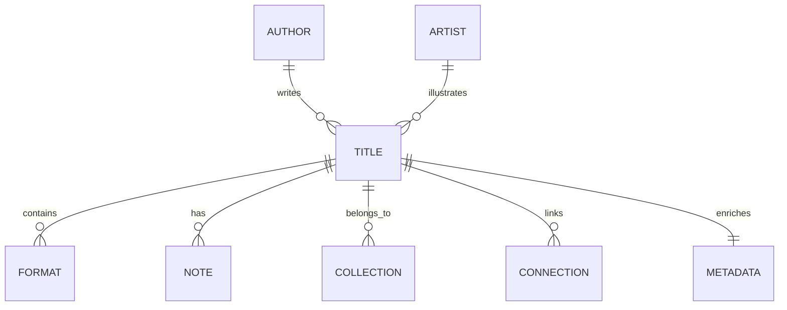
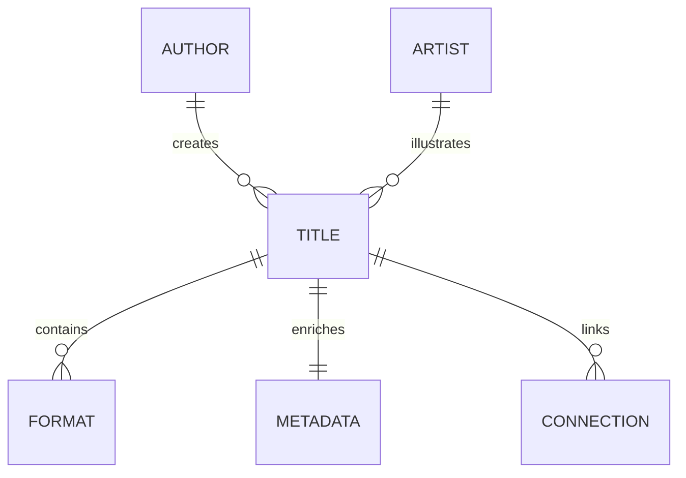
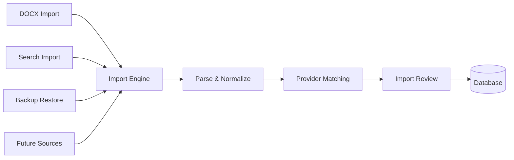

############################################################
## 05_ARCHITECTURE.md
############################################################

# GLIV v2

# 05_ARCHITECTURE.md

> Version: 2.0
> Status: Locked Architecture

## High-Level Architecture



## Technology

- Electron
- React
- TypeScript
- SQLite
- Local-first
- Offline-first

## Data Layers

### Layer 1 — Personal Data

Permanent.

- Progress
- Progress Override
- Notes
- Ratings
- Favorites
- Collections
- Original Order

### Layer 2 — Metadata

Refreshable.

- Titles
- Formats
- Contributors
- Genres
- Publication Information
- Connections

### Layer 3 — Live Information

Temporary.

- Latest releases
- Airing information
- Hiatus status
- Announcements

## Provider Strategy

### Anime

Primary

- AniList

Secondary

- Jikan

### Manga / Manhwa / Manhua

Primary

- MangaUpdates

Secondary

- Comick

### Novels

Primary

- MangaUpdates

Secondary

- None

Titles not supported by a provider become Manual Titles.

## Core Principles

- The UI never communicates directly with providers.
- All provider communication passes through the Provider Manager.
- Personal data is never owned by providers.
- Manual Title creation exists outside Provider Manager routing.
- Only stable official APIs are used as primary provider integrations.
```

############################################################
## 06_DATABASE.md
############################################################

> **Status:** Superseded (Historical)
>
> This document is retained for historical reference only.
>
> The authoritative database schema is defined in **32_DATABASE_SPECIFICATION.md**.
>
> All future schema changes must be made only to **32_DATABASE_SPECIFICATION.md**.
# GLIV v2

# 06_DATABASE.md

## Core Model



## Main Entities

Title

Format

Metadata

Author

Artist

Connections

Collections

Notes

## Format

One title may contain:

-   Anime
-   Manga
-   Manhwa
-   Manhua
-   Novel

Each keeps:

-   Progress
-   Status
-   Dates
-   Format-specific information

Original Order belongs to the Title, never the format.

## Rule

There must never be duplicate Titles.

############################################################
## 07_PROVIDERS.md
############################################################

# GLIV v2

# 07_PROVIDERS.md

> Version: 2.0
> Status: Locked Architecture

## Philosophy

Providers enrich GLIV.

They never own the user's personal data.

GLIV is capability-driven, not provider-driven. Each capability uses the most appropriate provider while preserving a consistent user experience.

## Anime

### Primary

- AniList

### Secondary

- Jikan

Used for:

- Posters
- Airing information
- Trailers
- Characters
- Studios
- Genres

## Manga / Manhwa / Manhua

### Primary

- MangaUpdates

### Secondary

- Comick

### MangaUpdates provides

- Latest releases
- Scanlation Groups
- Official Publishers
- Official Platforms
- License Status
- Hiatus information
- Story Connections
- Alternative Titles
- Publication information
- Contributors

### Comick provides

- Posters
- Covers
- Backup artwork

## Novels

### Primary

- MangaUpdates

### Secondary

- None

MangaUpdates provides:

- Publication information
- Latest releases
- Story Connections
- Alternative Titles
- Contributors

If a novel is unavailable through MangaUpdates, it may be added as a **Manual Title**.

Manual Titles:

- do not synchronize with providers,
- receive no live updates,
- do not calculate Effective Latest,
- remain completely user-managed.

## Availability

Provider-backed Formats may expose:

- Official Platform
- Official Publisher
- Scanlation Groups
- Translation Status
- Latest Official Release
- Latest Scanlation Release
- License Status

Availability is presented on the Series Page and is not a navigation feature.

## Sync


## Principles

- Providers enrich, never replace, user data.
- Personal data is never overwritten.
- Stable official APIs are preferred.
- Unsupported titles become Manual Titles rather than relying on unofficial integrations.

############################################################
## 17_DECISIONS.md
############################################################

# GLIV v2

# 17_DECISIONS.md

> Version: 2.0
> Status: Locked Architecture

## Purpose

Architecture Decision Records (ADRs) capture the major architectural decisions made throughout the project.

Each ADR records:
- The decision.
- The alternatives considered.
- The reason the decision was chosen.

ADRs are append-only. If a decision changes in the future, a new ADR should supersede the previous one rather than rewriting history.

---

## ADR-001 Desktop Application

**Decision**

Use Electron.

**Alternative**

Tauri.

**Reason**

Electron provides a mature ecosystem, excellent AI-assisted development support, long-term maintainability, and broad community adoption.

---

## ADR-002 Local First

**Decision**

Use SQLite with an offline-first architecture.

**Reason**

The library always remains available without an internet connection. Providers enrich the library but never own user data.

---

## ADR-003 Three-Layer Architecture

**Decision**

Separate all information into three independent layers.

- Layer 1 — Personal Data
- Layer 2 — Metadata
- Layer 3 — Live Information

**Reason**

Each layer has different ownership, update rules, and persistence requirements.

---

## ADR-004 Library First

**Decision**

GLIV always opens to the Library.

**Reason**

The Library is the primary workspace and the application's main purpose.

---

## ADR-005 Navigation

**Decision**

Top-level navigation consists of:

- Library
- Collections
- Discover
- Updates
- Settings

Availability is a Series Page capability rather than a navigation destination.

---

## ADR-006 Provider Strategy

**Decision**

Use a capability-driven provider architecture.

### Anime

Primary:
- AniList

Secondary:
- Jikan

### Manga / Manhwa / Manhua / Novel

Primary:
- MangaUpdates

Secondary:
- Comick (Manga / Manhwa / Manhua only)

Novels have no secondary provider.

Unsupported titles are handled as Manual Titles.

**Reason**

Use only stable official APIs as primary integrations while selecting the best provider for each capability.

---

## ADR-007 One Title, Multiple Formats

**Decision**

One Title may contain multiple independent Formats.

Each Format maintains its own:

- Progress
- Publication information
- Contributors
- Provider relationships

**Reason**

Different media formats of the same story should remain together while preserving independent tracking.

---

## ADR-008 Connection Model

**Decision**

Connections represent relationships between Titles.

Supported relationships include:

- Prequel
- Sequel
- Continuation
- Side Story
- Spin-off
- Shared Universe
- Adaptation
- Original Source
- Remake
- Reboot
- Crossover

Relationships such as Same Author and Same Artist are derived from Contributor relationships and are not stored as Connection types.

---

## ADR-009 Import Engine

**Decision**

All imports use a unified Import Engine regardless of entry point.

Supported entry points include:

- DOCX Import
- Search Import
- Restore
- Future import sources

Only deterministic matches may bypass Import Review.

External provider matches always require Import Review.

**Reason**

A single import pipeline provides consistent behavior while preventing incorrect automatic merges.

---

## ADR-010 Contributor Model

**Decision**

Replace separate Author and Artist entities with a unified Contributor model.

Each Contributor is attached to a Format using a role.

Supported roles in v1:

- Author
- Artist

**Reason**

This removes duplicate data, supports creators with multiple roles, and better reflects provider data.

---

## ADR-011 Manual Titles

**Decision**

Titles without a supported provider may be added as Manual Titles.

Manual Titles:

- remain fully user-managed,
- receive no provider synchronization,
- do not calculate Effective Latest,
- do not provide live availability information.

**Reason**

This allows unsupported series to exist without introducing unstable provider integrations.

---

## ADR-012 External References

**Decision**

External provider mappings are stored separately from personal data.

Mappings belong to individual Formats rather than Titles.

Each mapping records:

- Provider
- Provider Entity ID
- Verification State

**Reason**

Provider mappings remain independent from personal information and support multiple provider relationships for different Formats.

---

## ADR-013 Progress Override

**Decision**

Provider-backed Formats may define a Progress Override.

Progress Override:

- exists independently from provider values,
- contributes to Effective Latest,
- is manually editable,
- is automatically removed once provider data catches up.

Manual Titles do not support Progress Override.

**Reason**

This allows temporary provider gaps to be handled without permanently modifying provider data.

---

## ADR-014 External References Field Correction

**Context**

ADR-012 defined external_references with three fields: Provider, Provider Entity ID, Verification State. Two decisions made afterward assumed more than that schema could hold: 19_IMPORT_SYSTEM.md states "Confidence and Verification State are independent," and ADR-009 defines a deterministic-match path that bypasses Import Review entirely. The original schema had no field to store a confidence score, and no verification state that represented an automatic match distinct from a human-reviewed one.

**Decision**

Supersedes ADR-012.

external_references gains two fields ADR-012 omitted: `confidence` and `last_verified`. The `provider` field is renamed `provider_id`, since it is a foreign key into the `providers` table, not a raw string.

Verification state gains a fourth value, AUTO, to represent deterministic matches that bypass Import Review under ADR-009. The prior VERIFIED state is renamed USER_CONFIRMED, to distinguish "a person looked at this and approved it" from "the system linked this without review because the match was deterministic."

Final field set:

- format_id
- provider_id
- provider_entity_id
- confidence
- verification_state (AUTO / PENDING / USER_CONFIRMED / USER_REJECTED)
- last_verified

**Alternatives Considered**

- Compute confidence on demand instead of storing it. Rejected — once provider data changes, the original match confidence can't be reconstructed, and audit/history needs to show what confidence a mapping was created at.
- Fold AUTO into PENDING rather than adding a new state. Rejected — PENDING specifically means "awaiting user action." A deterministic match never needs user action, so labeling it PENDING would misrepresent it in the UI and in Edit History.

**Rationale**

This brings the schema in line with decisions already locked elsewhere (ADR-009, 19_IMPORT_SYSTEM.md) rather than introducing new scope. Nothing here changes provider strategy, routing, or any UI-facing behavior beyond what was already decided.

**Consequences**

- Every code path that creates an external_reference row (Import Engine, Search Import, manual linking) must supply `confidence` and pick the correct verification_state.
- Re-syncing a Title that already has a USER_CONFIRMED or AUTO reference for the same provider_id + provider_entity_id updates that row's `last_verified` rather than creating a new PENDING candidate.
- BR-002 (Title Identity & Import Resolution) can now be written against a schema that actually supports what ADR-009 and 19_IMPORT_SYSTEM.md already promise.

---

## ADR-015 Comick Provider Rejected

**Context**

Comick has no official, documented public API. Every available integration path found (PHP wrapper classes, Go wrappers, scraper-based "source APIs," third-party Apify actors) is an unofficial client built against an undocumented internal endpoint, maintained by unrelated third parties with no versioning, changelog, or stability guarantee.

ADR-006 listed Comick as the Secondary provider for Manga / Manhwa / Manhua (posters, covers, backup artwork). Because Comick was Secondary rather than Primary, 03_PRINCIPLES.md's "only stable official APIs for primary integrations" rule did not technically forbid it — but depending on an undocumented, unofficial endpoint for any production integration, even a fallback one, is a risk this project is choosing not to accept.

**Decision**

Supersedes ADR-006, Comick portion only. AniList, Jikan, and MangaUpdates are unaffected.

Comick is removed from GLIV entirely. The Secondary provider for Manga / Manhwa / Manhua becomes **None** — the same pattern already used for Novels, which have no Secondary provider.

No replacement Secondary is introduced for Poster/Cover fallback. When MangaUpdates artwork is unavailable, GLIV falls back directly to the placeholder-artwork behavior already defined in 23_SERIES_CARD_SPECIFICATION.md ("Empty Metadata") and the graceful-failure behavior already defined in 46_CACHE_SYSTEM_SPECIFICATION.md. No new component or logic is required to support this.

**Supersession Notice**

Every existing mention of Comick anywhere in the documentation set is superseded by this ADR and must be treated as void, including:

- `05_ARCHITECTURE.md` — the `CM[Comick]` node and `PM --> CM` edge in the architecture diagram; "Manga / Manhwa / Manhua Secondary: Comick"
- `07_PROVIDERS.md` — the "Secondary — Comick" line and the "Comick provides" section
- ADR-006 (`17_DECISIONS.md`) — "Secondary: Comick (Manga / Manhwa / Manhua only)"
- `20_PROVIDER_MANAGER.md` — "Manga / Manhwa / Manhua Secondary: Comick"
- `21_SEARCH_ENGINE.md` — "Comick (Secondary for Manga / Manhwa / Manhua only)"
- `60_PROVIDER_CAPABILITY_MATRIX.md` — the Comick cell in the Poster/Cover row, and the "Comick" provider summary section
- `23_SERIES_CARD_SPECIFICATION.md` — step 4 ("Comick") in the poster priority list
- `31_PROVIDER_MANAGER_SPECIFICATION.md` — "Secondary — Comick" and the Comick branch of the Search Flow diagram
- `GLIV_PROJECT_SUMMARY.md` — the "Comick" cell in the Providers table

None of these files need to be hand-edited before implementation begins. This ADR is binding wherever it conflicts with any of them, exactly as `18_DATABASE_SCHEMA.md` is already marked Superseded relative to `32_DATABASE_SPECIFICATION.md`. Any implementation agent or reviewer encountering "Comick" elsewhere in the docs should treat it as historical/void text.

**Alternatives Considered**

- Keep Comick since Secondary providers aren't held to the stable-API rule. Rejected — a fallback role still means production code depends on an undocumented target that could change or disappear without notice, for a capability (posters) that no Business Rule depends on.
- Hand-edit all nine locations above immediately. Rejected for now — the docs are already stabilized and locked; this ADR fully neutralizes every mention without touching locked files. Physical cleanup can happen later as routine housekeeping and doesn't block implementation.

**Rationale**

Same pattern already used twice in this doc set: NovelUpdates was removed as a provider during stabilization, and ADR-014 corrected external_references without rewriting ADR-012. ADRs are append-only specifically so a later decision can override an earlier one without touching every downstream file.

**Consequences**

- The Provider Manager (`20_PROVIDER_MANAGER.md`, `31_PROVIDER_MANAGER_SPECIFICATION.md`) is implemented with routing for AniList, Jikan, and MangaUpdates only. No Comick client, endpoint, or fallback path is built.
- `60_PROVIDER_CAPABILITY_MATRIX.md`'s Poster/Cover capability has a Secondary value of None for Manga / Manhwa / Manhua, matching every Novel row.
- `23_SERIES_CARD_SPECIFICATION.md`'s poster priority is effectively: User override (future) → MangaUpdates → AniList → Placeholder.
- Any future ADR reintroducing a secondary poster/cover source must supersede both this ADR and the relevant portion of ADR-006.

---

## ADR-016 Metadata and Notes Placement

**Context**

During the Database Schema implementation (Module 02), decisions were required on where to attach Metadata (Synopsis, Genres, Tags, Characters, Alternative Titles) and Personal Notes in the database schema. While Contributors were explicitly called out as a Format-level exception in the documentation, Metadata and Notes attachment was not explicitly locked. Additionally, `43_FILTER_SYSTEM_SPECIFICATION.md` requires Discover and Library filters to query by Genre, which SQLite cannot efficiently do if Genres are stored in a JSON column. Finally, a contradiction was identified in the `status` enum values between `08_LIBRARY.md` (5 values) and `43_FILTER_SYSTEM_SPECIFICATION.md` (6 values, including "Planning").

**Decision**

1. Metadata (Synopsis, Genres, Tags, Characters, Alternative Titles) and Personal Notes are attached to `title_id`, not `format_id`.
2. Genres, Tags, and Characters are stored in normalized junction tables (`genres`, `title_genres`, etc.) rather than as JSON columns in the `metadata` table.
3. The Format `status` enum is locked to exactly 5 values: `Reading`, `Watching`, `Completed`, `Paused`, `Dropped`.

**Rationale**

1. Attaching metadata and notes to Titles aligns with `12_SEARCH_SERIES.md`, where the Series Page layout displays Synopsis and Personal Notes once at the Series level rather than per Format Card.
2. Normalized junction tables provide the necessary performance and queryability for the filtering system specified in `43_FILTER_SYSTEM_SPECIFICATION.md`.
3. The "Planning" status in `43_FILTER_SYSTEM_SPECIFICATION.md` contradicts the Library's core scope rule ("Only Titles you have started appear in the Library") and is redundant with the "Plan to Watch / Read" built-in collection. Locking to 5 values resolves this contradiction correctly.

**Consequences**

- The database schema (Module 02) implements normalized junction tables and Title-level attachments for metadata and notes.
- The `formats.status` column is strictly constrained to the 5 approved values.
- As a routine documentation cleanup, `43_FILTER_SYSTEM_SPECIFICATION.md` should have "Planning" removed from its status filter list in a future housekeeping update. This does not block implementation.

---

## ADR-017 Personal Tags

**Context**

`43_FILTER_SYSTEM_SPECIFICATION.md` lists "Personal Tags" under the Personal
filter category (Layer 1, user-owned) — separate and distinct from "Genre"
under the Metadata category (Layer 2, provider-owned). The Module 02
schema and its patch (`003_ARCHITECTURE_PATCH_metadata_publication.md`)
built `tags` / `title_tags` to normalize provider-sourced Tags only, since
that patch's stated purpose was making Discover/Library able to filter
provider metadata efficiently. Nothing in the schema represents
user-created Personal Tags, leaving a real gap between two documents that
were never reconciled.

**Decision**

Add two new tables, distinct from `tags` / `title_tags`:

- `personal_tags` (id, name)
- `title_personal_tags` (title_id, personal_tag_id)

Personal Tags are Layer 1. They are created, renamed, and deleted only by
the user. Provider synchronization and the Import Engine never read or
write these tables.

**Alternatives Considered**

- Add a source column (`PROVIDER` / `USER`) to the existing `tags` table
instead of a second table. Rejected — every other Layer 1/Layer 2 split
in this schema uses separate tables (`metadata` vs `notes`,
`external_references` vs Progress Override), not a shared table with a
discriminator column. A shared table means every future provider
metadata refresh query must remember to filter by source, or it risks
touching personal data — the exact failure mode `03_PRINCIPLES.md` and
`45_SYNC_ENGINE_SPECIFICATION.md` exist to prevent. A separate table
makes that mistake structurally impossible instead of relying on every
future query remembering a `WHERE` clause.

**Rationale**

Consistent with the pattern already used throughout this schema: Layer 1
and Layer 2 data are never stored in the same table, even when the data
looks superficially similar (a "tag" is a tag either way, but ownership
and sync behavior differ completely).

**Consequences**

- `43_FILTER_SYSTEM_SPECIFICATION.md`'s Personal Tags filter queries
`title_personal_tags` directly, the same way its Genre filter queries
`title_genres`.
- Provider sync (`45_SYNC_ENGINE_SPECIFICATION.md`) and the Import Engine
require no changes — they were never touching Personal Tags and
continue not to.
- Deleting a `personal_tag` is a destructive action affecting every Title
using it; per `44_DIALOG_SYSTEM_SPECIFICATION.md`'s Confirmation Dialog
pattern, this should require confirmation. This is a Design-layer
follow-up, not a schema blocker — noted here so it isn't lost.

---

## ADR-018 Split-Tier Cache: Library Persistent / Discover In-Memory

**Context**

46_CACHE_SYSTEM_SPECIFICATION.md defines a single cache layer without specifying whether entries persist across application restarts. Module 05 planning surfaced this as a genuine gap — the roadmap calls it "Local Cache," which fits either an in-memory or a persistent implementation.

Two existing decisions bear on this. ADR-002 commits GLIV to offline-first behavior. Separately, 45_SYNC_ENGINE_SPECIFICATION.md and BR-002 already draw a line between provider-backed Formats that belong to a Title in the user's Library (which have an `external_reference` and participate in ongoing synchronization) and provider data encountered only through Discover/Search (which does not belong to the Library and is never synchronized). A single uniform cache tier ignores a distinction the rest of the architecture already makes.

**Decision**

The Cache System is split into two tiers.

**Library Tier (Persistent).** Applies to provider-backed Formats that belong to a Title in the user's Library. Stored in a new `cache_entries` table (see 32_DATABASE_SPECIFICATION.md patch). Survives application restarts.

**Discover Tier (In-Memory).** Applies to search/browse results not yet added to the Library. Never written to disk. Fully cleared when the application closes.

The caller (e.g., Import Engine or UI route controller) supplies the scope explicitly. Provider Manager simply forwards it to the Cache System without inferring or re-deciding it. The Cache System never infers scope by querying the database.

**No promotion on Library entry.** When a Discover result is added to the Library through Import Review (BR-002), its in-memory entry is not copied into the persistent tier. The persistent entry is populated naturally by the first Sync Engine cycle for that Format.

**Orphan grace period on Library removal.** When a Format is removed from the Library, its Library-tier `cache_entries` rows are not deleted immediately. Instead, `orphaned_at` is set to the removal time. If the same Format is added back to the Library before 7 days have passed, `orphaned_at` is cleared and the entry resumes normal behavior. If 7 days pass, the entry is permanently deleted by a startup cleanup routine.

The orphan window never overrides normal freshness. An entry past its `expires_at` is treated as a miss and triggers a normal provider refetch when read, regardless of whether it is also within its 7-day orphan window. `orphaned_at` governs only whether the row still exists on disk, never whether it is considered fresh.

**Alternatives Considered**

- *Single persistent tier for everything.* Rejected — Discover/search results churn constantly and have no "belongs to the Library" boundary to bound growth; persisting them indefinitely bloats the database for data unlikely to be reused.
- *Single in-memory tier for everything.* Rejected — this weakens the offline-first guarantee for data the user actually tracks: a full app restart would force re-fetching provider data for every Format already in the Library, which 45_SYNC_ENGINE_SPECIFICATION.md's design otherwise avoids.
- *CacheService or Provider Manager infers scope via a database lookup instead of an explicit caller-supplied parameter.* Rejected — this adds a database round-trip to every cache read/write. The caller already knows the context of the operation it's performing.
- *Delete Library-tier entries immediately on removal, no grace period.* Rejected — accidental removal, or removal/re-adding during routine library reorganization, would force an unnecessary provider refetch with no benefit.
- *Promote a Discover entry into the persistent tier at the moment Import Review commits.* Rejected — this is migration logic for a case the Sync Engine already handles naturally on its next cycle; unnecessary complexity for this module's first release.

**Rationale**

This aligns cache persistence with a boundary the architecture already draws elsewhere (BR-002, BR-003, 45_SYNC_ENGINE_SPECIFICATION.md) rather than inventing a new one. It keeps the Cache System's contract simple — the caller states which tier applies — and avoids scope creep into promotion or migration logic that no Business Rule currently requires.

**Consequences**

- `cache_entries` (32_DATABASE_SPECIFICATION.md) stores Library-tier entries only, and gains a nullable `orphaned_at` field.
- `CacheService.get` / `CacheService.set` require an explicit `scope: 'library' | 'discover'` parameter, supplied by the caller.
- The Discover tier is a simple in-memory structure with no schema, no persistence, and no orphan tracking. It is fully cleared on process exit.
- A startup cleanup routine deletes any `cache_entries` row whose `orphaned_at` is more than 7 days in the past.
- Removing a Format from the Library sets `orphaned_at` on its cache_entries rows rather than deleting them; re-adding the same Format within 7 days clears `orphaned_at`.
- Any future Diagnostics/Settings surface reporting cache size or status must account for two tiers, not one.

---

## ADR-019 Planned Titles Storage Model

**Context**
`09_COLLECTIONS.md` lists Plan to Watch/Read as a built-in Collection. `GLIV_PROJECT_SUMMARY.md` describes collection membership as if the Title already exists in the Library. But `08_LIBRARY.md` restricts the Library to started Titles only, and ADR-016 already rejected a "Planning" status for exactly that reason. No document ever defined what data structure a Plan to Watch/Read entry actually is. This has a real practical cost: 01_VISION.md's own stated Problem — duplicate entries in the original DOCX library — reappears inside GLIV if Search can't recognize "I already planned this," the same way it recognizes "I already own this."

**Decision**
Add `planned_titles`, separate from `titles`/`formats`:
```
planned_titles
id
display_title
media_type
provider_id        (nullable)
provider_entity_id (nullable)
added_at
```
- Created only through the Plan to Watch/Read collection — no separate nav destination.
- `provider_id`/`provider_entity_id` nullable: a planned entry may reference a provider result or be freeform, the same way Manual Titles handle "no provider" for real Library entries.
- Never becomes a Format. No status, no progress, no Effective Latest — it exists only to record intent and support duplicate detection.
- Universal Search checks `planned_titles` alongside `titles`/`formats` when flagging "already known" — distinctly, e.g. `libraryState: 'ALREADY_PLANNED'` vs `'IN_LIBRARY'`, so you can tell "I'm tracking this" from "I already meant to check this out."
- **Graduating** a planned entry into a real Format (you actually start it) goes through the normal Search/Import flow; the `planned_titles` row is deleted once the real `titles`/`formats` row exists. Exact UI for that is a future Collections module's job.
- The default Library screen is unchanged — started Titles only. Plan to Watch/Read lives in the Collections tab, using the sorting/filtering already specified in `27_COLLECTIONS_SPECIFICATION.md`.

**Alternatives Considered**
- *Reintroduce "Planning" as a status.* Rejected — reopens exactly what ADR-016 closed.
- *Relax `collection_items`' `title_id` requirement instead of a new table.* Rejected — turns every future query against `collection_items` into a "which kind of row did I get" check.
- *Leave it undefined until a Collections module exists.* Rejected — Search needs to know what "already known" means now, or it ships with the same duplicate-entry bug GLIV exists to fix.

**Consequences**
- `32_DATABASE_SPECIFICATION.md` needs a `planned_titles` patch, same pattern as ADR-018's `cache_entries` patch.
- Module 06 can't fully solve duplicate detection until this table exists — see below.
- A future Collections module owns creating/removing `planned_titles` rows and the graduation workflow.

############################################################
## 18_DATABASE_SCHEMA.md
############################################################

# GLIV v2

# 18_DATABASE_SCHEMA.md

> Version: 1.0
> Status: Superseded (Historical)
>
> This document is preserved for historical reference only.
>
> The authoritative database schema is:
>
> **32_DATABASE_SPECIFICATION.md**
>
> All future schema changes must be made there.



## Tables

- Title
- Format
- Metadata
- Author
- Artist
- Connections
- Collections
- Notes

## Historical Rules

- UUID keys
- No duplicate Titles
- Original Order belongs to Title
- Layer 1 never overwritten

---

**Historical Note**

This schema has been superseded by **32_DATABASE_SPECIFICATION.md**, which introduces the finalized architecture including:

- Contributor model
- External References
- Provider configuration
- Sync history
- Edit history
- Progress Override
- Manual Titles
- Final provider architecture

############################################################
## 19_IMPORT_SYSTEM.md
############################################################

# GLIV v2

# 19_IMPORT_SYSTEM.md

> Version: 2.0
> Status: Locked Architecture

## Import Engine

GLIV uses a single Import Engine regardless of where the import originates.

### Supported Entry Points

- DOCX Import
- Search Import
- Backup Restore
- Future Import Sources
- Add Another Format (Series Page)

### Add Another Format

The Series Page provides an **Add Another Format** workflow.

This is a constrained variant of Search Import.

The destination Title is already known.

Provider Identity Matching follows BR-002.

Library Duplicate Matching is skipped because the destination Title has already been selected.

All entry points converge into the same import pipeline.



## Common Pipeline

Every import follows the same process:

1. Parse source data.
2. Normalize imported information.
3. Match against provider data.
4. Generate candidate matches.
5. Present Import Review when required.
6. Commit approved results.

## Import Review

Import Review exists to prevent incorrect merges.

### Automatically processed

Only deterministic matches may bypass Import Review.

Example:

- Existing provider mapping already linked through an External Reference.

### Always reviewed

All provider-derived matches require Import Review, regardless of confidence.

Confidence influences the suggested action but never bypasses review.

Possible actions:

- Merge with existing Title
- Create new Title
- Create Manual Title
- Skip

## Principles

- Never silently infer data.
- Every import is reversible.
- Confidence and Verification State are independent.
- Manual confirmation always wins over provider suggestions.

############################################################
## 20_PROVIDER_MANAGER.md
############################################################

# GLIV v2

# 20_PROVIDER_MANAGER.md

> Version: 2.0
> Status: Locked Architecture

## Purpose

The Provider Manager is responsible for all communication with external providers.

The UI never communicates with providers directly.

## Responsibilities

- Search
- Metadata retrieval
- Availability
- Connections
- Live updates
- Cache management
- Provider URL generation

## Provider Routing

### Anime

Primary:
- AniList

Secondary:
- Jikan

### Manga / Manhwa / Manhua

Primary:
- MangaUpdates

Secondary:
- Comick

### Novels

Primary:
- MangaUpdates

Secondary:
- None

Unsupported novels are handled as Manual Titles.

## Request Flow

```text
Primary
   ↓
Cache
   ↓
Secondary
   ↓
Graceful Failure
```

## Manual Titles

Manual Title creation is outside the Provider Manager.

The Provider Manager only handles provider-backed titles.

## URL Generation

External References store only provider identifiers.

Provider URLs are generated by the Provider Manager when needed.

## Failure Policy

- Provider failures never interrupt the application.
- Cached data is preferred when available.
- Missing provider data degrades gracefully.
- Personal data is never affected by provider failures.

## Principles

- Providers enrich GLIV.
- Providers never own user data.
- Routing is capability-driven, not provider-driven.
- UI never communicates directly with providers.

############################################################
## 21_SEARCH_ENGINE.md
############################################################

# GLIV v2

# 21_SEARCH_ENGINE.md

> Version: 2.0
> Status: Locked Architecture

## Purpose

The Search Engine provides a unified search experience regardless of the underlying provider.

Search results are normalized into a common internal format before being displayed.

## Search Sources

### Anime

- AniList
- Jikan

### Manga / Manhwa / Manhua / Novel

- MangaUpdates
- Comick (Secondary for Manga / Manhwa / Manhua only)

## Search Flow


## Result Normalization

Every provider result is converted into a common internal structure before reaching the UI.

Common fields include:

- Title
- Formats
- Poster
- Contributors
- Publication Information
- Availability
- Provider References

## Search Results

Each result may provide:

- Add to Library
- View Details

If no suitable provider result exists, the user may:

- Create Manual Title

## Principles

- One search interface for every supported format.
- Provider differences remain invisible to the user.
- Search results are normalized before display.
- Manual Title creation is available when no supported provider result exists.
- GLIV applies no content rating or age filtering. All provider results are shown exactly as returned.
- Filtering by content rating or maturity level is out of scope for v1.

############################################################
## 32_DATABASE_SPECIFICATION.md
############################################################

# GLIV v2

# 32_DATABASE_SPECIFICATION.md

> Version: 2.0
> Status: Authoritative Database Schema

## Purpose

This document defines the authoritative database schema for GLIV.

All future database changes must be made here.

---

## Core Tables

- titles
- formats
- publication_info
- official_platforms
- scanlation_groups
- metadata
- genres
- title_genres
- tags
- title_tags
- personal_tags
- title_personal_tags
- characters
- title_characters
- alternative_titles
- contributors
- format_contributors
- connections
- collections
- collection_items
- planned_titles
- notes
- external_references
- providers
- sync_history
- edit_history
- cache_entries

---

## titles

Stores one logical story.

A Title may contain one or more Formats.

Layer:

- Personal
- Metadata

---

## formats

Each Format belongs to exactly one Title.

Supported Formats:

- Anime
- Manga
- Manhwa
- Manhua
- Novel

Each Format maintains independent:

- Progress
- Status
- Publication Information
- Availability
- Provider relationships

progress_unit

Enum

Values:

- Episode
- Chapter
- Volume

The canonical progress unit is assigned when the Format is created.

For provider-backed Formats, it is determined from provider metadata.

For Manual Titles, it is selected by the user.

Once assigned, the value is immutable and is never modified by provider synchronization.

---

## publication_info

One row per provider-backed Format.

Fields:
- format_id (FK → formats, unique — one-to-one)
- publication_status
- start_date
- end_date
- chapter_count
- episode_count
- volume_count
- latest_official_release
- latest_scanlation_release
- official_publisher
- license_status

Layer: Publication (Layer 3), refreshable, never overwrites personal data.

---

## official_platforms

Many rows per Format — a Format may be available on more than one official platform.

Fields:
- id
- format_id (FK → formats)
- platform_name

Layer: Publication.

---

## scanlation_groups

Many rows per Format.

Fields:
- id
- format_id (FK → formats)
- group_name
- latest_release
- release_date
- translation_status
- active_status

Layer: Live (Layer 3). Informational only, never affects personal progress.

---

## metadata

One row per Title. Refreshable provider metadata.

Fields:
- title_id (FK → titles, unique — one-to-one)
- synopsis

Genres, Tags, Characters, and Alternative Titles are normalized into their own
tables (below) rather than stored as columns here, so Discover/Library filters
can query them directly.

---

## genres / title_genres

genres: id, name
title_genres: title_id (FK), genre_id (FK) — many-to-many

---

## tags / title_tags

tags: id, name
title_tags: title_id (FK), tag_id (FK) — many-to-many

---

## personal_tags / title_personal_tags

User-created tags, entirely distinct from provider-sourced tags.

personal_tags:
id, name (UNIQUE)

title_personal_tags:
title_id (FK → titles)
personal_tag_id (FK → personal_tags)
UNIQUE(title_id, personal_tag_id)

Layer: Personal (Layer 1).
personal_tags are created, renamed, and deleted only through explicit user
action. Provider synchronization and the Import Engine never read from or
write to personal_tags or title_personal_tags.
A personal_tag may be attached to multiple Titles. Deleting a personal_tag
detaches it from every Title that used it; it does not delete the Titles
themselves.

---

## characters / title_characters

characters: id, name
title_characters: title_id (FK), character_id (FK) — many-to-many

---

## alternative_titles

id, title_id (FK), alt_title — one-to-many

---

## contributors

Stores people.

Examples:

- Author
- Artist

A single Contributor may perform multiple roles across different Formats.

---

## format_contributors

Associates Contributors with Formats.

Fields:

- format_id
- contributor_id
- role

Supported roles (v1):

- Author
- Artist

Unique constraint:

- contributor_id
- format_id
- role

---

## connections

Relationships between Titles.

Supported relationships:

- Prequel
- Sequel
- Continuation
- Spin-off
- Side Story
- Shared Universe
- Adaptation
- Original Source
- Remake
- Reboot
- Crossover

Relationships such as Same Author and Same Artist are derived from Contributor relationships and are not stored.

---

## collections

User collections.

Includes built-in collections:

- Favorites
- Plan to Watch / Read

Plan to Watch / Read is backed by `planned_titles`, not `collection_items` — its members are not `titles` rows (see `planned_titles`, ADR-019). All other collections, including custom ones, continue to use `collection_items` against real `titles` rows as before.

Supports unlimited custom collections.

---

## collection_items

Many-to-many relationship between Titles and Collections.

---

## planned_titles

Stores Plan to Watch / Read entries — Titles the user intends to start but has not yet begun.

Deliberately separate from `titles` / `formats`. Per 08_LIBRARY.md, the Library contains only Titles the user has started; a planned entry has no Format, no progress, no status, and must never be forced into that model just to support collection membership (see ADR-019).

Fields:

- id
- display_title
- media_type
- provider_id (nullable, FK → providers)
- provider_entity_id (nullable)
- added_at

`provider_id` / `provider_entity_id` are nullable: a planned entry may reference a specific provider result (found via Search) or be entered freeform with no provider match, mirroring how Manual Titles handle "no provider" for real Library entries.

Layer: Personal (Layer 1). Provider synchronization never reads or writes this table.

A `planned_titles` row is deleted once the user actually starts the Title — at that point a normal `titles` / `formats` row is created through the standard Search / Import flow, and the planned entry no longer serves a purpose. This graduation workflow belongs to a future Collections module.

Universal Search checks `planned_titles` alongside `titles` / `formats` so a search result can be flagged `ALREADY_PLANNED`, distinct from `IN_LIBRARY` — letting the user tell "I already meant to check this out" from "I'm already tracking this," which is the entire reason this table exists (see ADR-019, Context).

---

## notes

Fields:
- title_id (FK → titles)
- content

Personal Notes are attached to the Title, not the Format — matching
12_SEARCH_SERIES.md, where Personal Notes appear once per Series Page.

---

## ## external_references

Stores provider mappings for provider-backed Formats.

Fields:

- format_id
- provider_id
- provider_entity_id
- confidence
- verification_state
- last_verified

`provider_id` references the `providers` table. The mapping never stores a raw provider name inline.

`confidence` is the match confidence recorded when this reference was created or last re-matched by the Import Engine or Search. It is stored independently from `verification_state` and is never overwritten by a manual confirmation.

Verification states:

- AUTO
- PENDING
- USER_CONFIRMED
- USER_REJECTED

AUTO is used only for deterministic matches that bypass Import Review (see ADR-009). Every other provider-derived match is created as PENDING and requires Import Review to move to USER_CONFIRMED or USER_REJECTED.

USER_REJECTED mappings are never automatically retried and remain until manually removed by the user.

`last_verified` records the timestamp verification_state was last set, including the moment an AUTO mapping is created.

Provider URLs are generated by the Provider Manager and are not stored.
---

## providers

Configuration for supported providers.

Stores provider-level configuration such as:

- Provider name
- Priority
- Capabilities
- API configuration

---

## sync_history

Stores synchronization history.

Examples:

- Last sync
- Provider
- Result
- Duration

---

## edit_history

Stores user edit history.

Examples:

- Progress changes
- Progress Override changes
- Rating changes
- Collection changes
- Notes changes

---

## cache_entries

Stores persistent cache entries for the **Library tier** only — provider-backed Formats belonging to a Title currently in the user's Library. Discover/search results are cached in-memory only (see 46_CACHE_SYSTEM_SPECIFICATION.md) and never appear in this table.

Fields:

- key
- provider_id
- provider_entity_id
- capability
- payload
- cached_at
- expires_at
- orphaned_at

`key` is a unique identifier composed from `provider_id` + `capability` + `provider_entity_id`.

`payload` stores the cached provider-sourced value only. Layer 1 personal data is never stored here.

`expires_at` governs normal freshness. An entry past `expires_at` is treated as a miss and triggers a fresh provider fetch, regardless of `orphaned_at`.

`orphaned_at` is set when the owning Format is removed from the Library, and cleared if the Format is added back to the Library before 7 days have passed. Entries with `orphaned_at` older than 7 days are deleted automatically on application startup.

`orphaned_at` never affects freshness — it governs only whether the row still exists.

Manual Formats never have `cache_entries` rows, at either tier.

---

## Progress Override

Progress Override belongs to individual provider-backed Formats.

It exists independently from provider values.

Effective Latest is computed using:

- Latest Official Release
- Latest Scanlation Release
- Progress Override (if present)

Progress Override is automatically removed once provider data reaches or exceeds the overridden value.

Manual Titles do not support Progress Override.

---

## Manual Titles

Manual Titles have no External References.

They:

- do not synchronize with providers,
- do not calculate Effective Latest,
- do not expose provider availability,
- remain fully user-managed.

---

## Design Principles

- One Title may contain multiple Formats.
- Formats own provider relationships.
- Contributors belong to Formats through roles.
- Provider mappings remain separate from personal data.
- Personal data is never overwritten.
- External providers enrich the library but never own it.

############################################################
## 45_SYNC_ENGINE_SPECIFICATION.md
############################################################

# GLIV v2

# 45_SYNC_ENGINE.md

> Version: 2.0
> Status: Locked Architecture

## Purpose

The Sync Engine refreshes provider-backed data while preserving all personal information.

Synchronization enriches the library but never replaces user-owned data.

## Sync Scope

### Layer 1 — Personal Data

Never synchronized.

Includes:

- Progress
- Progress Override
- Notes
- Ratings
- Favorites
- Collections
- Original Order

### Layer 2 — Metadata

Refreshable.

Examples:

- Synopsis
- Genres
- Contributors
- Publication Information
- Connections

### Layer 3 — Live Information

Continuously refreshable.

Examples:

- Latest releases
- Hiatus status
- Announcements
- Airing information

## Sync Flow

```text
Provider
    ↓
Provider Manager
    ↓
Cache
    ↓
Sync Engine
    ↓
Database
```

## Sync Rules

- Layer 1 is never modified.
- Layer 2 refreshes only provider-managed fields.
- Layer 3 always reflects the newest provider information.
- Manual Titles are excluded from synchronization.
- Provider failures never affect personal data.

## Progress Override

Progress Override is personal data.

It is never overwritten by synchronization.

If provider data reaches or exceeds the overridden value, the Progress Override is automatically removed.

## External References

Only provider-backed Formats with valid External References participate in synchronization.

## Sync History

Every synchronization records:

- Provider
- Time
- Result
- Duration

## Principles

- Synchronization is deterministic.
- Personal data always wins.
- Manual Titles remain completely user-managed.
- Provider communication occurs only through the Provider Manager.

############################################################
## 46_CACHE_SYSTEM_SPECIFICATION.md
############################################################

# GLIV v2

# 46_CACHE_SYSTEM.md

> Version: 2.0
> Status: Locked Architecture

## Purpose

The Cache System reduces unnecessary provider requests, improves responsiveness, and enables graceful operation during temporary provider outages.

Cache is an optimization layer and never becomes the source of truth.

---

## Cache Tiers (ADR-016)

The Cache System operates in two tiers.

### Library Tier (Persistent)

Applies to provider-backed Formats belonging to a Title currently in the user's Library — that is, Formats with an `external_reference` per BR-002.

Stored in the `cache_entries` table (see 32_DATABASE_SPECIFICATION.md). Survives application restarts.

### Discover Tier (In-Memory)

Applies to search/browse results not yet added to the Library.

Never persisted to disk. Fully cleared when the application closes.

### Scope Selection

The Provider Manager determines which tier applies to each request and passes it explicitly (`scope: 'library' | 'discover'`). The Cache System never infers the tier through a database lookup.

---

## Cached Information

Examples include:

- Search results
- Metadata
- Posters
- Availability
- Publication information
- Live updates

Personal data is never cached as provider data.

---

## Cache Flow

```text
Provider
    ↓
Provider Manager
    ↓
Cache
    ↓
Application
```

---

## Cache Rules

- Provider data is cached after successful retrieval.
- Cached data may be used when a provider is temporarily unavailable.
- Expired cache entries are refreshed automatically.
- Cache never overwrites personal data.
- Manual Titles do not participate in provider caching.
- Discover-tier entries are never persisted and do not participate in orphan retention.

---

## Cache Invalidation

Cache entries may be refreshed when:

- Expiration time is reached.
- A manual refresh is requested.
- Provider data changes.
- Cache is cleared by the user.

---

## Orphaned Entries (ADR-016)

When a Format is removed from the Library, its Library-tier cache entries are not deleted immediately.

Entries are marked orphaned and retained for 7 days, allowing the same Format to reuse its cached data if it is added back to the Library within that window.

After 7 days, orphaned entries are permanently deleted by a startup cleanup routine.

Orphan status never overrides normal expiration. An entry past its `expires_at` is still treated as a miss, even while it is within its 7-day orphan window.

---

## Failure Handling

If a provider is unavailable:

1. Use cached data when available.
2. Attempt the configured secondary provider (if one exists).
3. Gracefully continue with the latest available information.

If no provider data exists, the application continues normally without interrupting the user.

---

## Principles

- Cache improves performance.
- Cache never owns data.
- Personal information always remains authoritative.
- Provider communication always occurs through the Provider Manager.

############################################################
## 60_PROVIDER_CAPABILITY_MATRIX.md
############################################################

# GLIV v2

# 60_PROVIDER_CAPABILITY_MATRIX.md

> Version: 2.0
> Status: Locked Architecture

## Purpose

This matrix defines which provider supplies each capability.

GLIV is capability-driven rather than provider-driven.

The Provider Manager selects the most appropriate provider for each capability.

---

| Capability | Primary | Secondary | Stored As |
|------------|----------|------------|-----------|
| Title | AniList / MangaUpdates | — | Metadata |
| Alternative Titles | MangaUpdates | AniList | Metadata |
| Synopsis | AniList | MangaUpdates | Metadata |
| Poster / Cover | AniList / MangaUpdates | Comick | Metadata |
| Contributors | MangaUpdates | AniList | Metadata |
| Genres | AniList | MangaUpdates | Metadata |
| Characters | AniList | — | Metadata |
| Studios | AniList | — | Metadata |
| Publication Information | MangaUpdates | AniList | Publication |
| Story Connections | MangaUpdates | AniList | Connections |
| Official Publisher | MangaUpdates | — | Publication |
| Official Platforms | MangaUpdates | — | Availability |
| License Status | MangaUpdates | — | Availability |
| Latest Official Release | MangaUpdates | — | Live |
| Latest Scanlation Release | MangaUpdates | — | Live |
| Scanlation Groups | MangaUpdates | — | Live |
| Hiatus Status | MangaUpdates | AniList | Live |
| Airing Information | AniList | Jikan | Live |
| Trailers | AniList | Jikan | Live |

---

## Provider Summary

### AniList

Primary for:

- Anime metadata
- Genres
- Characters
- Studios
- Airing information
- Trailers

Secondary for:

- Publication information
- Story connections
- Alternative titles
- Contributors

---

### MangaUpdates

Primary for:

- Manga
- Manhwa
- Manhua
- Novels
- Publication information
- Story connections
- Contributors
- Official releases
- Scanlation information
- Availability

---

### Comick

Secondary provider for:

- Posters
- Covers

---

### Jikan

Secondary provider for:

- Anime information
- Airing information
- Trailers

---

## Manual Titles

Manual Titles have no provider capabilities.

Information is entered and maintained entirely by the user.

They do not receive:

- Provider synchronization
- Availability
- Live updates
- Effective Latest

---

## Principles

- Capabilities determine provider selection.
- Provider routing is transparent to the user.
- Personal data never depends on provider data.
- Only stable official APIs are used as primary providers.

############################################################
## 61_PUBLICATION_MODEL.md
############################################################

# GLIV v2

# 61_PUBLICATION_MODEL.md

> Version: 2.0
> Status: Locked Architecture

## Purpose

The Publication Model stores publication and release information for each provider-backed Format.

Publication information is independent from personal progress and is refreshed through provider synchronization.

---

## Publication Information

Each Format may store:

- Publication Status
- Start Date
- End Date
- Chapter Count
- Episode Count
- Volume Count
- Latest Official Release
- Latest Scanlation Release
- Official Publisher
- Official Platforms
- License Status

---

## Availability

Availability is derived from publication information and provider data.

Examples include:

- Official Publisher
- Official Platforms
- Translation Status
- License Status
- Latest Official Release
- Latest Scanlation Release

Availability is displayed on the Series Page and is not a navigation destination.

---

## Provider Ownership

Publication information is provider-managed.

It may be refreshed during synchronization.

Personal information is never stored in the Publication Model.

---

## Manual Titles

Manual Titles do not participate in the Publication Model.

Publication information for Manual Titles is managed entirely by the user.

Features unavailable to Manual Titles include:

- Provider synchronization
- Availability
- Effective Latest
- Live publication updates

---

## Principles

- Publication information belongs to individual Formats.
- Publication data is independent from personal progress.
- Availability is derived from provider data.
- Personal data is never modified by publication updates.

############################################################
## 63_SCANLATION_GROUPS.md
############################################################

# GLIV v2

# 63_SCANLATION_GROUPS.md

> Version: 2.0
> Status: Locked Architecture

## Purpose

Scanlation Groups provide information about unofficial translations available for provider-backed Formats.

This information enriches Availability and Publication data but never affects personal progress.

---

## Stored Information

Each provider-backed Format may include:

- Group Name
- Latest Release
- Release Date
- Translation Status
- Active Status

---

## Availability

Scanlation Groups contribute to the Availability section of the Series Page.

Examples include:

- Current scanlation group
- Latest translated chapter
- Translation status

Scanlation information is informational only and is never treated as personal data.

---

## Provider Ownership

Scanlation information is supplied by providers and refreshed during synchronization.

It belongs to Layer 3 (Live Information).

---

## Manual Titles

Manual Titles do not contain Scanlation Group information.

---

## Principles

- Scanlation Groups are provider-managed.
- Personal progress remains completely independent.
- Scanlation information enriches Availability but never replaces personal tracking.

############################################################
## 64_PROGRESS_MODEL.md
############################################################

# GLIV v2

# 64_PROGRESS_MODEL.md

> Version: 2.0
> Status: Locked Architecture

## Purpose

The Progress Model defines how personal progress is tracked independently from provider information.

Personal progress always belongs to the user and is never overwritten by synchronization.

---

## Personal Progress

Each Format maintains independent personal progress.

Examples:

- Anime → Episodes watched
- Manga → Chapters read
- Manhwa → Chapters read
- Manhua → Chapters read
### Novel

Novel progress uses the Format's canonical progress unit.

The canonical progress unit is assigned when the Format is created.

For provider-backed Formats, the unit is determined from provider metadata during the initial import or synchronization.

For Manual Titles, the unit is selected by the user during creation.

Once assigned, the canonical progress unit is immutable.

Provider synchronization never changes the assigned progress unit for an existing Format.

Supported units include:

- Chapter
- Volume

All progress-related values for the Format use the same canonical progress unit, including:

- Personal Progress
- Progress Override
- Latest Official Release
- Latest Scanlation Release
- Effective Latest
- Remaining

Unit conversion is never performed.

---

## Provider Progress

Provider-backed Formats may contain:

- Latest Official Release
- Latest Scanlation Release

These values belong to provider-managed data.

---

## Progress Override

Provider-backed Formats may define a Progress Override.

Progress Override:

- is stored independently from provider data,
- contributes to Effective Latest,
- may be edited or removed by the user,
- is automatically removed when provider data reaches or exceeds the overridden value.

Manual Titles do not support Progress Override.

---

## Effective Latest

Effective Latest represents the highest available progress for a provider-backed Format.

It is calculated using:

- Latest Official Release
- Latest Scanlation Release
- Progress Override (when present)

Effective Latest always uses the highest available value.

---

## Display

Provider-backed Formats display progress as:

```
Personal Progress / Effective Latest
```

Example:

```
210 / 223
```

Manual Titles display only personal progress because no provider information exists.

---

## Synchronization

Synchronization may update:

- Latest Official Release
- Latest Scanlation Release

Synchronization never modifies:

- Personal Progress
- Progress Override

---

## Principles

- Personal progress always belongs to the user.
- Every Format maintains independent progress.
- Effective Latest is computed from provider information and Progress Override.
- Manual Titles remain completely independent of provider progress.

