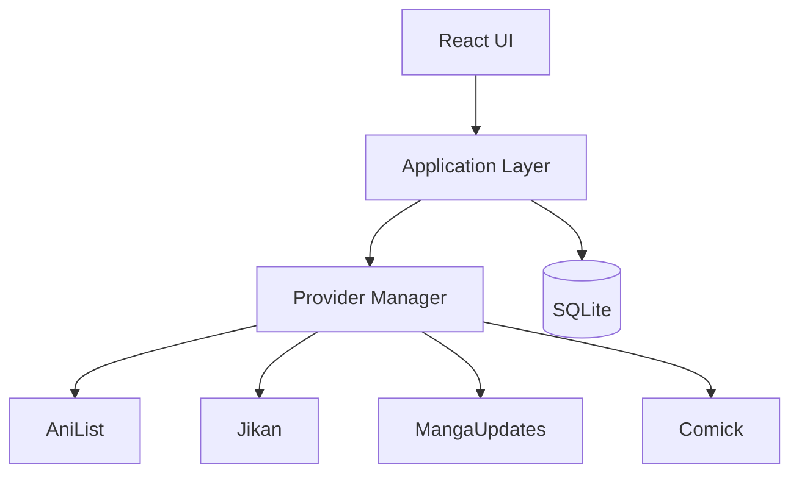
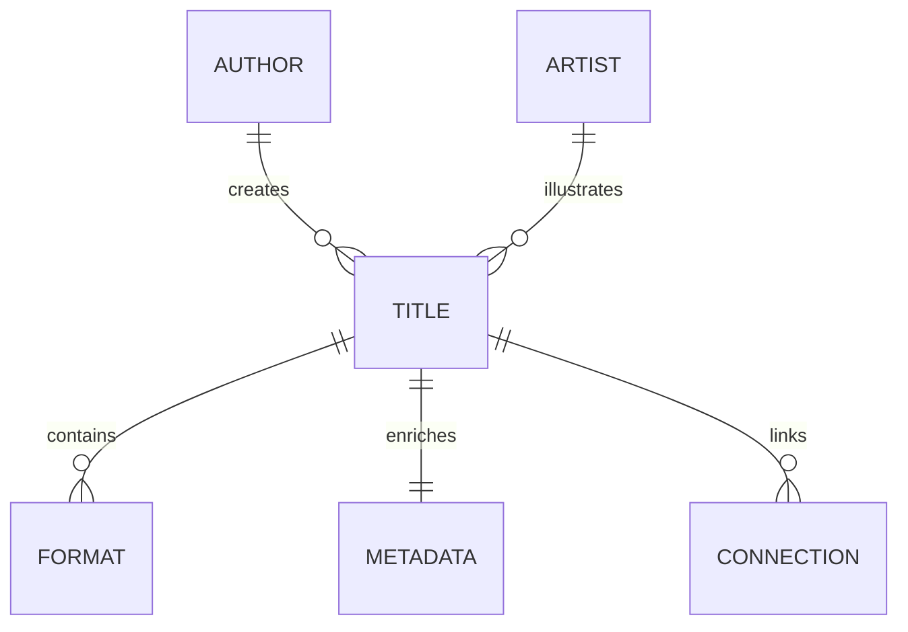
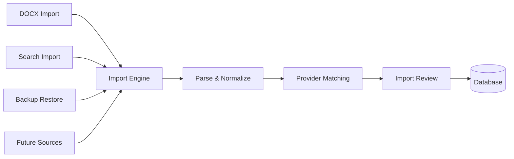

############################################################
## 05_ARCHITECTURE.md
############################################################

# # GLIV v2

# 05_ARCHITECTURE.md

> Version: 2.0
> Status: Locked Architecture

## High-Level Architecture



## Technology

- Electron
- React
- TypeScript
- SQLite
- Local-first
- Offline-first

## Data Layers

### Layer 1 — Personal Data

Permanent.

- Progress
- Progress Override
- Notes
- Ratings
- Favorites
- Collections
- Original Order

### Layer 2 — Metadata

Refreshable.

- Titles
- Formats
- Contributors
- Genres
- Publication Information
- Connections

### Layer 3 — Live Information

Temporary.

- Latest releases
- Airing information
- Hiatus status
- Announcements

## Provider Strategy

### Anime

Primary

- AniList

Secondary

- Jikan

### Manga / Manhwa / Manhua

Primary

- MangaUpdates

Secondary

- Comick

### Novels

Primary

- MangaUpdates

Secondary

- None

Titles not supported by a provider become Manual Titles.

## Core Principles

- The UI never communicates directly with providers.
- All provider communication passes through the Provider Manager.
- Personal data is never owned by providers.
- Manual Title creation exists outside Provider Manager routing.
- Only stable official APIs are used as primary provider integrations.

############################################################
## 07_PROVIDERS.md
############################################################

# GLIV v2

# 07_PROVIDERS.md

> Version: 2.0
> Status: Locked Architecture

## Philosophy

Providers enrich GLIV.

They never own the user's personal data.

GLIV is capability-driven, not provider-driven. Each capability uses the most appropriate provider while preserving a consistent user experience.

## Anime

### Primary

- AniList

### Secondary

- Jikan

Used for:

- Posters
- Airing information
- Trailers
- Characters
- Studios
- Genres

## Manga / Manhwa / Manhua

### Primary

- MangaUpdates

### Secondary

- Comick

### MangaUpdates provides

- Latest releases
- Scanlation Groups
- Official Publishers
- Official Platforms
- License Status
- Hiatus information
- Story Connections
- Alternative Titles
- Publication information
- Contributors

### Comick provides

- Posters
- Covers
- Backup artwork

## Novels

### Primary

- MangaUpdates

### Secondary

- None

MangaUpdates provides:

- Publication information
- Latest releases
- Story Connections
- Alternative Titles
- Contributors

If a novel is unavailable through MangaUpdates, it may be added as a **Manual Title**.

Manual Titles:

- do not synchronize with providers,
- receive no live updates,
- do not calculate Effective Latest,
- remain completely user-managed.

## Availability

Provider-backed Formats may expose:

- Official Platform
- Official Publisher
- Scanlation Groups
- Translation Status
- Latest Official Release
- Latest Scanlation Release
- License Status

Availability is presented on the Series Page and is not a navigation feature.

## Sync


## Principles

- Providers enrich, never replace, user data.
- Personal data is never overwritten.
- Stable official APIs are preferred.
- Unsupported titles become Manual Titles rather than relying on unofficial integrations.

############################################################
## 17_DECISIONS.md
############################################################

# # GLIV v2

# 17_DECISIONS.md

> Version: 2.0
> Status: Locked Architecture

## Purpose

Architecture Decision Records (ADRs) capture the major architectural decisions made throughout the project.

Each ADR records:
- The decision.
- The alternatives considered.
- The reason the decision was chosen.

ADRs are append-only. If a decision changes in the future, a new ADR should supersede the previous one rather than rewriting history.

---

## ADR-001 Desktop Application

**Decision**

Use Electron.

**Alternative**

Tauri.

**Reason**

Electron provides a mature ecosystem, excellent AI-assisted development support, long-term maintainability, and broad community adoption.

---

## ADR-002 Local First

**Decision**

Use SQLite with an offline-first architecture.

**Reason**

The library always remains available without an internet connection. Providers enrich the library but never own user data.

---

## ADR-003 Three-Layer Architecture

**Decision**

Separate all information into three independent layers.

- Layer 1 — Personal Data
- Layer 2 — Metadata
- Layer 3 — Live Information

**Reason**

Each layer has different ownership, update rules, and persistence requirements.

---

## ADR-004 Library First

**Decision**

GLIV always opens to the Library.

**Reason**

The Library is the primary workspace and the application's main purpose.

---

## ADR-005 Navigation

**Decision**

Top-level navigation consists of:

- Library
- Collections
- Discover
- Updates
- Settings

Availability is a Series Page capability rather than a navigation destination.

---

## ADR-006 Provider Strategy

**Decision**

Use a capability-driven provider architecture.

### Anime

Primary:
- AniList

Secondary:
- Jikan

### Manga / Manhwa / Manhua / Novel

Primary:
- MangaUpdates

Secondary:
- Comick (Manga / Manhwa / Manhua only)

Novels have no secondary provider.

Unsupported titles are handled as Manual Titles.

**Reason**

Use only stable official APIs as primary integrations while selecting the best provider for each capability.

---

## ADR-007 One Title, Multiple Formats

**Decision**

One Title may contain multiple independent Formats.

Each Format maintains its own:

- Progress
- Publication information
- Contributors
- Provider relationships

**Reason**

Different media formats of the same story should remain together while preserving independent tracking.

---

## ADR-008 Connection Model

**Decision**

Connections represent relationships between Titles.

Supported relationships include:

- Prequel
- Sequel
- Continuation
- Side Story
- Spin-off
- Shared Universe
- Adaptation
- Original Source
- Remake
- Reboot
- Crossover

Relationships such as Same Author and Same Artist are derived from Contributor relationships and are not stored as Connection types.

---

## ADR-009 Import Engine

**Decision**

All imports use a unified Import Engine regardless of entry point.

Supported entry points include:

- DOCX Import
- Search Import
- Restore
- Future import sources

Only deterministic matches may bypass Import Review.

External provider matches always require Import Review.

**Reason**

A single import pipeline provides consistent behavior while preventing incorrect automatic merges.

---

## ADR-010 Contributor Model

**Decision**

Replace separate Author and Artist entities with a unified Contributor model.

Each Contributor is attached to a Format using a role.

Supported roles in v1:

- Author
- Artist

**Reason**

This removes duplicate data, supports creators with multiple roles, and better reflects provider data.

---

## ADR-011 Manual Titles

**Decision**

Titles without a supported provider may be added as Manual Titles.

Manual Titles:

- remain fully user-managed,
- receive no provider synchronization,
- do not calculate Effective Latest,
- do not provide live availability information.

**Reason**

This allows unsupported series to exist without introducing unstable provider integrations.

---

## ADR-012 External References

**Decision**

External provider mappings are stored separately from personal data.

Mappings belong to individual Formats rather than Titles.

Each mapping records:

- Provider
- Provider Entity ID
- Verification State

**Reason**

Provider mappings remain independent from personal information and support multiple provider relationships for different Formats.

---

## ADR-013 Progress Override

**Decision**

Provider-backed Formats may define a Progress Override.

Progress Override:

- exists independently from provider values,
- contributes to Effective Latest,
- is manually editable,
- is automatically removed once provider data catches up.

Manual Titles do not support Progress Override.

**Reason**

This allows temporary provider gaps to be handled without permanently modifying provider data.

---

## ADR-014 External References Field Correction

**Context**

ADR-012 defined external_references with three fields: Provider, Provider Entity ID, Verification State. Two decisions made afterward assumed more than that schema could hold: 19_IMPORT_SYSTEM.md states "Confidence and Verification State are independent," and ADR-009 defines a deterministic-match path that bypasses Import Review entirely. The original schema had no field to store a confidence score, and no verification state that represented an automatic match distinct from a human-reviewed one.

**Decision**

Supersedes ADR-012.

external_references gains two fields ADR-012 omitted: `confidence` and `last_verified`. The `provider` field is renamed `provider_id`, since it is a foreign key into the `providers` table, not a raw string.

Verification state gains a fourth value, AUTO, to represent deterministic matches that bypass Import Review under ADR-009. The prior VERIFIED state is renamed USER_CONFIRMED, to distinguish "a person looked at this and approved it" from "the system linked this without review because the match was deterministic."

Final field set:

- format_id
- provider_id
- provider_entity_id
- confidence
- verification_state (AUTO / PENDING / USER_CONFIRMED / USER_REJECTED)
- last_verified

**Alternatives Considered**

- Compute confidence on demand instead of storing it. Rejected — once provider data changes, the original match confidence can't be reconstructed, and audit/history needs to show what confidence a mapping was created at.
- Fold AUTO into PENDING rather than adding a new state. Rejected — PENDING specifically means "awaiting user action." A deterministic match never needs user action, so labeling it PENDING would misrepresent it in the UI and in Edit History.

**Rationale**

This brings the schema in line with decisions already locked elsewhere (ADR-009, 19_IMPORT_SYSTEM.md) rather than introducing new scope. Nothing here changes provider strategy, routing, or any UI-facing behavior beyond what was already decided.

**Consequences**

- Every code path that creates an external_reference row (Import Engine, Search Import, manual linking) must supply `confidence` and pick the correct verification_state.
- Re-syncing a Title that already has a USER_CONFIRMED or AUTO reference for the same provider_id + provider_entity_id updates that row's `last_verified` rather than creating a new PENDING candidate.
- BR-002 (Title Identity & Import Resolution) can now be written against a schema that actually supports what ADR-009 and 19_IMPORT_SYSTEM.md already promise.

############################################################
## 18_DATABASE_SCHEMA.md
############################################################

# GLIV v2

# 18_DATABASE_SCHEMA.md

> Version: 1.0
> Status: Superseded (Historical)
>
> This document is preserved for historical reference only.
>
> The authoritative database schema is:
>
> **32_DATABASE_SPECIFICATION.md**
>
> All future schema changes must be made there.



## Tables

- Title
- Format
- Metadata
- Author
- Artist
- Connections
- Collections
- Notes

## Historical Rules

- UUID keys
- No duplicate Titles
- Original Order belongs to Title
- Layer 1 never overwritten

---

**Historical Note**

This schema has been superseded by **32_DATABASE_SPECIFICATION.md**, which introduces the finalized architecture including:

- Contributor model
- External References
- Provider configuration
- Sync history
- Edit history
- Progress Override
- Manual Titles
- Final provider architecture

############################################################
## 19_IMPORT_SYSTEM.md
############################################################

# GLIV v2# GLIV v2

# 19_IMPORT_SYSTEM.md

> Version: 2.0
> Status: Locked Architecture

## Import Engine

GLIV uses a single Import Engine regardless of where the import originates.

### Supported Entry Points

- DOCX Import
- Search Import
- Backup Restore
- Future Import Sources
- Add Another Format (Series Page)

### Add Another Format

The Series Page provides an **Add Another Format** workflow.

This is a constrained variant of Search Import.

The destination Title is already known.

Provider Identity Matching follows BR-002.

Library Duplicate Matching is skipped because the destination Title has already been selected.

All entry points converge into the same import pipeline.



## Common Pipeline

Every import follows the same process:

1. Parse source data.
2. Normalize imported information.
3. Match against provider data.
4. Generate candidate matches.
5. Present Import Review when required.
6. Commit approved results.

## Import Review

Import Review exists to prevent incorrect merges.

### Automatically processed

Only deterministic matches may bypass Import Review.

Example:

- Existing provider mapping already linked through an External Reference.

### Always reviewed

All provider-derived matches require Import Review, regardless of confidence.

Confidence influences the suggested action but never bypasses review.

Possible actions:

- Merge with existing Title
- Create new Title
- Create Manual Title
- Skip

## Principles

- Never silently infer data.
- Every import is reversible.
- Confidence and Verification State are independent.
- Manual confirmation always wins over provider suggestions..

############################################################
## 20_PROVIDER_MANAGER.md
############################################################

# GLIV v2

# 20_PROVIDER_MANAGER.md

> Version: 2.0
> Status: Locked Architecture

## Purpose

The Provider Manager is responsible for all communication with external providers.

The UI never communicates with providers directly.

## Responsibilities

- Search
- Metadata retrieval
- Availability
- Connections
- Live updates
- Cache management
- Provider URL generation

## Provider Routing

### Anime

Primary:
- AniList

Secondary:
- Jikan

### Manga / Manhwa / Manhua

Primary:
- MangaUpdates

Secondary:
- Comick

### Novels

Primary:
- MangaUpdates

Secondary:
- None

Unsupported novels are handled as Manual Titles.

## Request Flow

```text
Primary
   ↓
Cache
   ↓
Secondary
   ↓
Graceful Failure
```

## Manual Titles

Manual Title creation is outside the Provider Manager.

The Provider Manager only handles provider-backed titles.

## URL Generation

External References store only provider identifiers.

Provider URLs are generated by the Provider Manager when needed.

## Failure Policy

- Provider failures never interrupt the application.
- Cached data is preferred when available.
- Missing provider data degrades gracefully.
- Personal data is never affected by provider failures.

## Principles

- Providers enrich GLIV.
- Providers never own user data.
- Routing is capability-driven, not provider-driven.
- UI never communicates directly with providers.

############################################################
## 21_SEARCH_ENGINE.md
############################################################

# GLIV v2

# 21_SEARCH_ENGINE.md

> Version: 2.0
> Status: Locked Architecture

## Purpose

The Search Engine provides a unified search experience regardless of the underlying provider.

Search results are normalized into a common internal format before being displayed.

## Search Sources

### Anime

- AniList
- Jikan

### Manga / Manhwa / Manhua / Novel

- MangaUpdates
- Comick (Secondary for Manga / Manhwa / Manhua only)

## Search Flow


## Result Normalization

Every provider result is converted into a common internal structure before reaching the UI.

Common fields include:

- Title
- Formats
- Poster
- Contributors
- Publication Information
- Availability
- Provider References

## Search Results

Each result may provide:

- Add to Library
- View Details

If no suitable provider result exists, the user may:

- Create Manual Title

## Principles

- One search interface for every supported format.
- Provider differences remain invisible to the user.
- Search results are normalized before display.
- Manual Title creation is available when no supported provider result exists.

############################################################
## 32_DATABASE_SPECIFICATION.md
############################################################

# # GLIV v2

# 32_DATABASE_SPECIFICATION.md

> Version: 2.0
> Status: Authoritative Database Schema

## Purpose

This document defines the authoritative database schema for GLIV.

All future database changes must be made here.

---

## Core Tables

- titles
- formats
- metadata
- contributors
- format_contributors
- connections
- collections
- collection_items
- notes
- external_references
- providers
- sync_history
- edit_history

---

## titles

Stores one logical story.

A Title may contain one or more Formats.

Layer:

- Personal
- Metadata

---

## formats

Each Format belongs to exactly one Title.

Supported Formats:

- Anime
- Manga
- Manhwa
- Manhua
- Novel

Each Format maintains independent:

- Progress
- Status
- Publication Information
- Availability
- Provider relationships

progress_unit

Enum

Values:

- Episode
- Chapter
- Volume

The canonical progress unit is assigned when the Format is created.

For provider-backed Formats, it is determined from provider metadata.

For Manual Titles, it is selected by the user.

Once assigned, the value is immutable and is never modified by provider synchronization.

---

## metadata

Refreshable provider metadata.

Examples:

- Synopsis
- Genres
- Tags
- Characters
- Alternative Titles

---

## contributors

Stores people.

Examples:

- Author
- Artist

A single Contributor may perform multiple roles across different Formats.

---

## format_contributors

Associates Contributors with Formats.

Fields:

- format_id
- contributor_id
- role

Supported roles (v1):

- Author
- Artist

Unique constraint:

- contributor_id
- format_id
- role

---

## connections

Relationships between Titles.

Supported relationships:

- Prequel
- Sequel
- Continuation
- Spin-off
- Side Story
- Shared Universe
- Adaptation
- Original Source
- Remake
- Reboot
- Crossover

Relationships such as Same Author and Same Artist are derived from Contributor relationships and are not stored.

---

## collections

User collections.

Includes built-in collections:

- Favorites
- Plan to Watch / Read

Supports unlimited custom collections.

---

## collection_items

Many-to-many relationship between Titles and Collections.

---

## notes

Personal notes.

Layer 1 only.

---

## ## external_references

Stores provider mappings for provider-backed Formats.

Fields:

- format_id
- provider_id
- provider_entity_id
- confidence
- verification_state
- last_verified

`provider_id` references the `providers` table. The mapping never stores a raw provider name inline.

`confidence` is the match confidence recorded when this reference was created or last re-matched by the Import Engine or Search. It is stored independently from `verification_state` and is never overwritten by a manual confirmation.

Verification states:

- AUTO
- PENDING
- USER_CONFIRMED
- USER_REJECTED

AUTO is used only for deterministic matches that bypass Import Review (see ADR-009). Every other provider-derived match is created as PENDING and requires Import Review to move to USER_CONFIRMED or USER_REJECTED.

USER_REJECTED mappings are never automatically retried and remain until manually removed by the user.

`last_verified` records the timestamp verification_state was last set, including the moment an AUTO mapping is created.

Provider URLs are generated by the Provider Manager and are not stored.
---

## providers

Configuration for supported providers.

Stores provider-level configuration such as:

- Provider name
- Priority
- Capabilities
- API configuration

---

## sync_history

Stores synchronization history.

Examples:

- Last sync
- Provider
- Result
- Duration

---

## edit_history

Stores user edit history.

Examples:

- Progress changes
- Progress Override changes
- Rating changes
- Collection changes
- Notes changes

---

## Progress Override

Progress Override belongs to individual provider-backed Formats.

It exists independently from provider values.

Effective Latest is computed using:

- Latest Official Release
- Latest Scanlation Release
- Progress Override (if present)

Progress Override is automatically removed once provider data reaches or exceeds the overridden value.

Manual Titles do not support Progress Override.

---

## Manual Titles

Manual Titles have no External References.

They:

- do not synchronize with providers,
- do not calculate Effective Latest,
- do not expose provider availability,
- remain fully user-managed.

---

## Design Principles

- One Title may contain multiple Formats.
- Formats own provider relationships.
- Contributors belong to Formats through roles.
- Provider mappings remain separate from personal data.
- Personal data is never overwritten.
- External providers enrich the library but never own it.

############################################################
## 45_SYNC_ENGINE_SPECIFICATION.md
############################################################

# GLIV v2

# 45_SYNC_ENGINE.md

> Version: 2.0
> Status: Locked Architecture

## Purpose

The Sync Engine refreshes provider-backed data while preserving all personal information.

Synchronization enriches the library but never replaces user-owned data.

## Sync Scope

### Layer 1 — Personal Data

Never synchronized.

Includes:

- Progress
- Progress Override
- Notes
- Ratings
- Favorites
- Collections
- Original Order

### Layer 2 — Metadata

Refreshable.

Examples:

- Synopsis
- Genres
- Contributors
- Publication Information
- Connections

### Layer 3 — Live Information

Continuously refreshable.

Examples:

- Latest releases
- Hiatus status
- Announcements
- Airing information

## Sync Flow

```text
Provider
    ↓
Provider Manager
    ↓
Cache
    ↓
Sync Engine
    ↓
Database
```

## Sync Rules

- Layer 1 is never modified.
- Layer 2 refreshes only provider-managed fields.
- Layer 3 always reflects the newest provider information.
- Manual Titles are excluded from synchronization.
- Provider failures never affect personal data.

## Progress Override

Progress Override is personal data.

It is never overwritten by synchronization.

If provider data reaches or exceeds the overridden value, the Progress Override is automatically removed.

## External References

Only provider-backed Formats with valid External References participate in synchronization.

## Sync History

Every synchronization records:

- Provider
- Time
- Result
- Duration

## Principles

- Synchronization is deterministic.
- Personal data always wins.
- Manual Titles remain completely user-managed.
- Provider communication occurs only through the Provider Manager.

############################################################
## 46_CACHE_SYSTEM_SPECIFICATION.md
############################################################

# GLIV v2

# 46_CACHE_SYSTEM.md

> Version: 2.0
> Status: Locked Architecture

## Purpose

The Cache System reduces unnecessary provider requests, improves responsiveness, and enables graceful operation during temporary provider outages.

Cache is an optimization layer and never becomes the source of truth.

---

## Cached Information

Examples include:

- Search results
- Metadata
- Posters
- Availability
- Publication information
- Live updates

Personal data is never cached as provider data.

---

## Cache Flow

```text
Provider
    ↓
Provider Manager
    ↓
Cache
    ↓
Application
```

---

## Cache Rules

- Provider data is cached after successful retrieval.
- Cached data may be used when a provider is temporarily unavailable.
- Expired cache entries are refreshed automatically.
- Cache never overwrites personal data.
- Manual Titles do not participate in provider caching.

---

## Cache Invalidation

Cache entries may be refreshed when:

- Expiration time is reached.
- A manual refresh is requested.
- Provider data changes.
- Cache is cleared by the user.

---

## Failure Handling

If a provider is unavailable:

1. Use cached data when available.
2. Attempt the configured secondary provider (if one exists).
3. Gracefully continue with the latest available information.

If no provider data exists, the application continues normally without interrupting the user.

---

## Principles

- Cache improves performance.
- Cache never owns data.
- Personal information always remains authoritative.
- Provider communication always occurs through the Provider Manager.

############################################################
## 60_PROVIDER_CAPABILITY_MATRIX.md
############################################################

# GLIV v2

# 60_PROVIDER_CAPABILITY_MATRIX.md

> Version: 2.0
> Status: Locked Architecture

## Purpose

This matrix defines which provider supplies each capability.

GLIV is capability-driven rather than provider-driven.

The Provider Manager selects the most appropriate provider for each capability.

---

| Capability | Primary | Secondary | Stored As |
|------------|----------|------------|-----------|
| Title | AniList / MangaUpdates | — | Metadata |
| Alternative Titles | MangaUpdates | AniList | Metadata |
| Synopsis | AniList | MangaUpdates | Metadata |
| Poster / Cover | AniList / MangaUpdates | Comick | Metadata |
| Contributors | MangaUpdates | AniList | Metadata |
| Genres | AniList | MangaUpdates | Metadata |
| Characters | AniList | — | Metadata |
| Studios | AniList | — | Metadata |
| Publication Information | MangaUpdates | AniList | Publication |
| Story Connections | MangaUpdates | AniList | Connections |
| Official Publisher | MangaUpdates | — | Publication |
| Official Platforms | MangaUpdates | — | Availability |
| License Status | MangaUpdates | — | Availability |
| Latest Official Release | MangaUpdates | — | Live |
| Latest Scanlation Release | MangaUpdates | — | Live |
| Scanlation Groups | MangaUpdates | — | Live |
| Hiatus Status | MangaUpdates | AniList | Live |
| Airing Information | AniList | Jikan | Live |
| Trailers | AniList | Jikan | Live |

---

## Provider Summary

### AniList

Primary for:

- Anime metadata
- Genres
- Characters
- Studios
- Airing information
- Trailers

Secondary for:

- Publication information
- Story connections
- Alternative titles
- Contributors

---

### MangaUpdates

Primary for:

- Manga
- Manhwa
- Manhua
- Novels
- Publication information
- Story connections
- Contributors
- Official releases
- Scanlation information
- Availability

---

### Comick

Secondary provider for:

- Posters
- Covers

---

### Jikan

Secondary provider for:

- Anime information
- Airing information
- Trailers

---

## Manual Titles

Manual Titles have no provider capabilities.

Information is entered and maintained entirely by the user.

They do not receive:

- Provider synchronization
- Availability
- Live updates
- Effective Latest

---

## Principles

- Capabilities determine provider selection.
- Provider routing is transparent to the user.
- Personal data never depends on provider data.
- Only stable official APIs are used as primary providers.

############################################################
## 61_PUBLICATION_MODEL.md
############################################################

# GLIV v2

# 61_PUBLICATION_MODEL.md

> Version: 2.0
> Status: Locked Architecture

## Purpose

The Publication Model stores publication and release information for each provider-backed Format.

Publication information is independent from personal progress and is refreshed through provider synchronization.

---

## Publication Information

Each Format may store:

- Publication Status
- Start Date
- End Date
- Chapter Count
- Episode Count
- Volume Count
- Latest Official Release
- Latest Scanlation Release
- Official Publisher
- Official Platforms
- License Status

---

## Availability

Availability is derived from publication information and provider data.

Examples include:

- Official Publisher
- Official Platforms
- Translation Status
- License Status
- Latest Official Release
- Latest Scanlation Release

Availability is displayed on the Series Page and is not a navigation destination.

---

## Provider Ownership

Publication information is provider-managed.

It may be refreshed during synchronization.

Personal information is never stored in the Publication Model.

---

## Manual Titles

Manual Titles do not participate in the Publication Model.

Publication information for Manual Titles is managed entirely by the user.

Features unavailable to Manual Titles include:

- Provider synchronization
- Availability
- Effective Latest
- Live publication updates

---

## Principles

- Publication information belongs to individual Formats.
- Publication data is independent from personal progress.
- Availability is derived from provider data.
- Personal data is never modified by publication updates.

############################################################
## 63_SCANLATION_GROUPS.md
############################################################

# GLIV v2

# 63_SCANLATION_GROUPS.md

> Version: 2.0
> Status: Locked Architecture

## Purpose

Scanlation Groups provide information about unofficial translations available for provider-backed Formats.

This information enriches Availability and Publication data but never affects personal progress.

---

## Stored Information

Each provider-backed Format may include:

- Group Name
- Latest Release
- Release Date
- Translation Status
- Active Status

---

## Availability

Scanlation Groups contribute to the Availability section of the Series Page.

Examples include:

- Current scanlation group
- Latest translated chapter
- Translation status

Scanlation information is informational only and is never treated as personal data.

---

## Provider Ownership

Scanlation information is supplied by providers and refreshed during synchronization.

It belongs to Layer 3 (Live Information).

---

## Manual Titles

Manual Titles do not contain Scanlation Group information.

---

## Principles

- Scanlation Groups are provider-managed.
- Personal progress remains completely independent.
- Scanlation information enriches Availability but never replaces personal tracking.

############################################################
## 64_PROGRESS_MODEL.md
############################################################

# # GLIV v2

# 64_PROGRESS_MODEL.md

> Version: 2.0
> Status: Locked Architecture

## Purpose

The Progress Model defines how personal progress is tracked independently from provider information.

Personal progress always belongs to the user and is never overwritten by synchronization.

---

## Personal Progress

Each Format maintains independent personal progress.

Examples:

- Anime → Episodes watched
- Manga → Chapters read
- Manhwa → Chapters read
- Manhua → Chapters read
### Novel

Novel progress uses the Format's canonical progress unit.

The canonical progress unit is assigned when the Format is created.

For provider-backed Formats, the unit is determined from provider metadata during the initial import or synchronization.

For Manual Titles, the unit is selected by the user during creation.

Once assigned, the canonical progress unit is immutable.

Provider synchronization never changes the assigned progress unit for an existing Format.

Supported units include:

- Chapter
- Volume

All progress-related values for the Format use the same canonical progress unit, including:

- Personal Progress
- Progress Override
- Latest Official Release
- Latest Scanlation Release
- Effective Latest
- Remaining

Unit conversion is never performed.

---

## Provider Progress

Provider-backed Formats may contain:

- Latest Official Release
- Latest Scanlation Release

These values belong to provider-managed data.

---

## Progress Override

Provider-backed Formats may define a Progress Override.

Progress Override:

- is stored independently from provider data,
- contributes to Effective Latest,
- may be edited or removed by the user,
- is automatically removed when provider data reaches or exceeds the overridden value.

Manual Titles do not support Progress Override.

---

## Effective Latest

Effective Latest represents the highest available progress for a provider-backed Format.

It is calculated using:

- Latest Official Release
- Latest Scanlation Release
- Progress Override (when present)

Effective Latest always uses the highest available value.

---

## Display

Provider-backed Formats display progress as:

```
Personal Progress / Effective Latest
```

Example:

```
210 / 223
```

Manual Titles display only personal progress because no provider information exists.

---

## Synchronization

Synchronization may update:

- Latest Official Release
- Latest Scanlation Release

Synchronization never modifies:

- Personal Progress
- Progress Override

---

## Principles

- Personal progress always belongs to the user.
- Every Format maintains independent progress.
- Effective Latest is computed from provider information and Progress Override.
- Manual Titles remain completely independent of provider progress.
