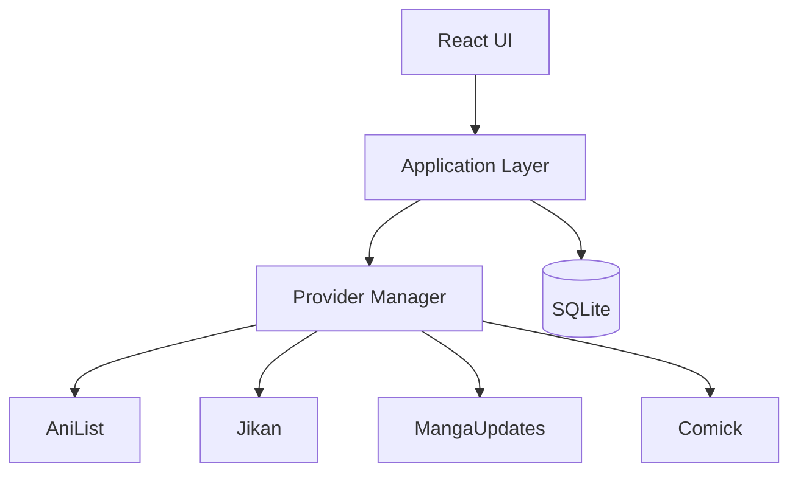

# GLIV v2

# 05_ARCHITECTURE.md

> Version: 2.0
> Status: Locked Architecture

## High-Level Architecture



## Technology

- Electron
- React
- TypeScript
- SQLite
- Local-first
- Offline-first

## Data Layers

### Layer 1 — Personal Data

Permanent.

- Progress
- Progress Override
- Notes
- Ratings
- Favorites
- Collections
- Original Order

### Layer 2 — Metadata

Refreshable.

- Titles
- Formats
- Contributors
- Genres
- Publication Information
- Connections

### Layer 3 — Live Information

Temporary.

- Latest releases
- Airing information
- Hiatus status
- Announcements

## Provider Strategy

### Anime

Primary

- AniList

Secondary

- Jikan

### Manga / Manhwa / Manhua

Primary

- MangaUpdates

Secondary

- Comick

### Novels

Primary

- MangaUpdates

Secondary

- None

Titles not supported by a provider become Manual Titles.

## Core Principles

- The UI never communicates directly with providers.
- All provider communication passes through the Provider Manager.
- Personal data is never owned by providers.
- Manual Title creation exists outside Provider Manager routing.
- Only stable official APIs are used as primary provider integrations.
```