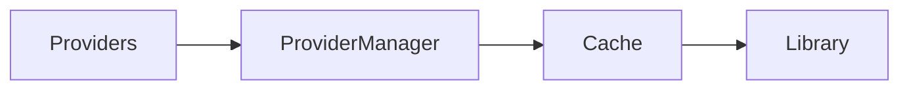

# GLIV v2

# 07_PROVIDERS.md

> Version: 2.0
> Status: Locked Architecture

## Philosophy

Providers enrich GLIV.

They never own the user's personal data.

GLIV is capability-driven, not provider-driven. Each capability uses the most appropriate provider while preserving a consistent user experience.

## Anime

### Primary

- AniList

### Secondary

- Jikan

Used for:

- Posters
- Airing information
- Trailers
- Characters
- Studios
- Genres

## Manga / Manhwa / Manhua

### Primary

- MangaUpdates

### Secondary

- Comick

### MangaUpdates provides

- Latest releases
- Scanlation Groups
- Official Publishers
- Official Platforms
- License Status
- Hiatus information
- Story Connections
- Alternative Titles
- Publication information
- Contributors

### Comick provides

- Posters
- Covers
- Backup artwork

## Novels

### Primary

- MangaUpdates

### Secondary

- None

MangaUpdates provides:

- Publication information
- Latest releases
- Story Connections
- Alternative Titles
- Contributors

If a novel is unavailable through MangaUpdates, it may be added as a **Manual Title**.

Manual Titles:

- do not synchronize with providers,
- receive no live updates,
- do not calculate Effective Latest,
- remain completely user-managed.

## Availability

Provider-backed Formats may expose:

- Official Platform
- Official Publisher
- Scanlation Groups
- Translation Status
- Latest Official Release
- Latest Scanlation Release
- License Status

Availability is presented on the Series Page and is not a navigation feature.

## Sync

## Principles

- Providers enrich, never replace, user data.
- Personal data is never overwritten.
- Stable official APIs are preferred.
- Unsupported titles become Manual Titles rather than relying on unofficial integrations.