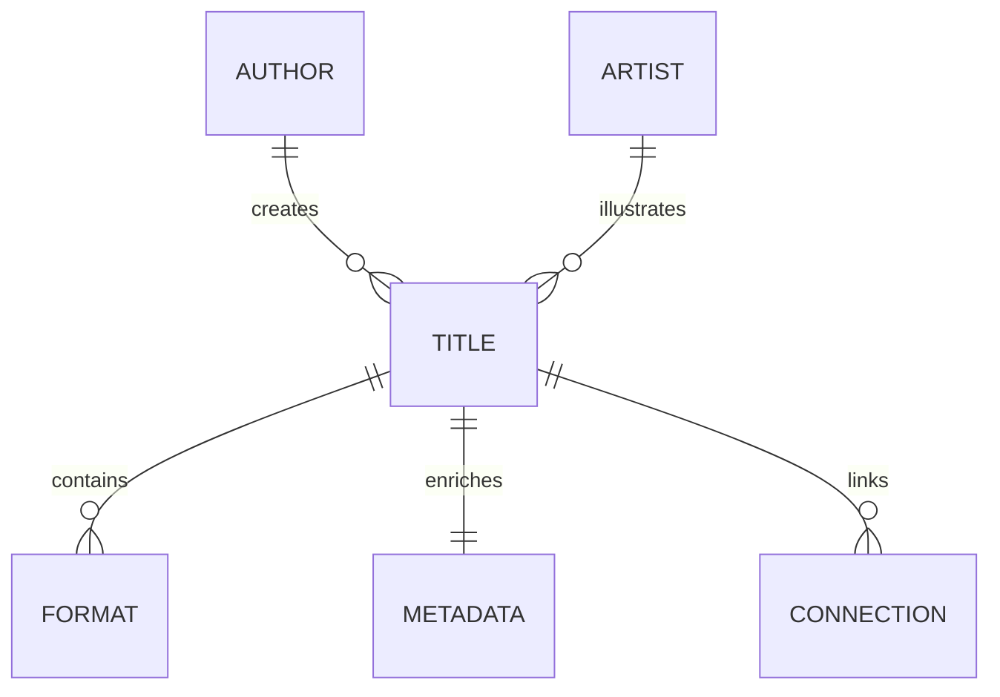

# GLIV v2

# 18_DATABASE_SCHEMA.md

> Version: 1.0
> Status: Superseded (Historical)
>
> This document is preserved for historical reference only.
>
> The authoritative database schema is:
>
> **32_DATABASE_SPECIFICATION.md**
>
> All future schema changes must be made there.

## Tables

- Title
- Format
- Metadata
- Author
- Artist
- Connections
- Collections
- Notes

## Historical Rules

- UUID keys
- No duplicate Titles
- Original Order belongs to Title
- Layer 1 never overwritten

---

**Historical Note**

This schema has been superseded by **32_DATABASE_SPECIFICATION.md**, which introduces the finalized architecture including:

- Contributor model
- External References
- Provider configuration
- Sync history
- Edit history
- Progress Override
- Manual Titles
- Final provider architecture