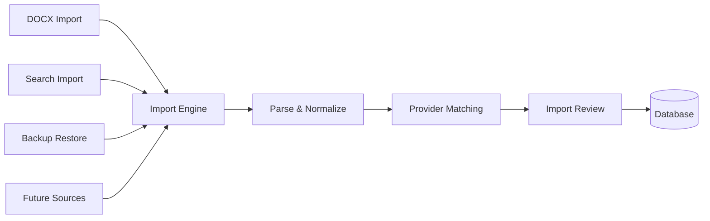

# GLIV v2

# 19_IMPORT_SYSTEM.md

> Version: 2.0
> Status: Locked Architecture

## Import Engine

GLIV uses a single Import Engine regardless of where the import originates.

### Supported Entry Points

- DOCX Import
- Search Import
- Backup Restore
- Future Import Sources
- Add Another Format (Series Page)

### Add Another Format

The Series Page provides an **Add Another Format** workflow.

This is a constrained variant of Search Import.

The destination Title is already known.

Provider Identity Matching follows BR-002.

Library Duplicate Matching is skipped because the destination Title has already been selected.

All entry points converge into the same import pipeline.

## Common Pipeline

Every import follows the same process:

1. Parse source data.
2. Normalize imported information.
3. Match against provider data.
4. Generate candidate matches.
5. Present Import Review when required.
6. Commit approved results.

## Import Review

Import Review exists to prevent incorrect merges.

### Automatically processed

Only deterministic matches may bypass Import Review.

Example:

- Existing provider mapping already linked through an External Reference.

### Always reviewed

All provider-derived matches require Import Review, regardless of confidence.

Confidence influences the suggested action but never bypasses review.

Possible actions:

- Merge with existing Title
- Create new Title
- Create Manual Title
- Skip

## Principles

- Never silently infer data.
- Every import is reversible.
- Confidence and Verification State are independent.
- Manual confirmation always wins over provider suggestions.