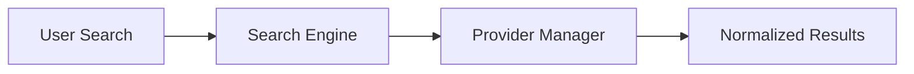

# GLIV v2

# 21_SEARCH_ENGINE.md

> Version: 2.0
> Status: Locked Architecture

## Purpose

The Search Engine provides a unified search experience regardless of the underlying provider.

Search results are normalized into a common internal format before being displayed.

## Search Sources

### Anime

- AniList
- Jikan

### Manga / Manhwa / Manhua / Novel

- MangaUpdates
- Comick (Secondary for Manga / Manhwa / Manhua only)

## Search Flow

## Result Normalization

Every provider result is converted into a common internal structure before reaching the UI.

Common fields include:

- Title
- Formats
- Poster
- Contributors
- Publication Information
- Availability
- Provider References

## Search Results

Each result may provide:

- Add to Library
- View Details

If no suitable provider result exists, the user may:

- Create Manual Title

## Principles

- One search interface for every supported format.
- Provider differences remain invisible to the user.
- Search results are normalized before display.
- Manual Title creation is available when no supported provider result exists.
- GLIV applies no content rating or age filtering. All provider results are shown exactly as returned.
- Filtering by content rating or maturity level is out of scope for v1.