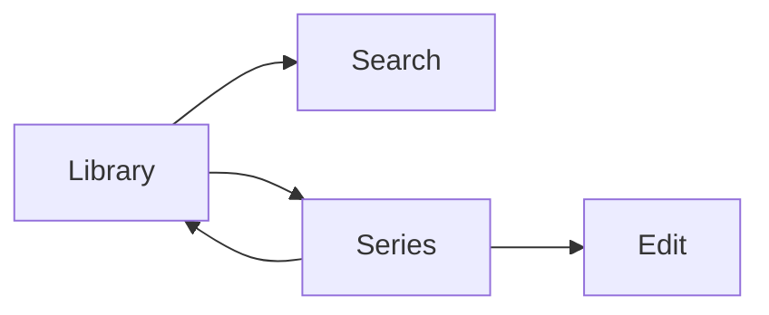
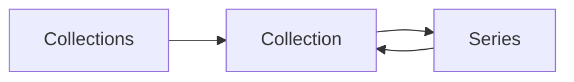
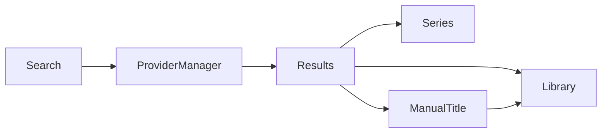
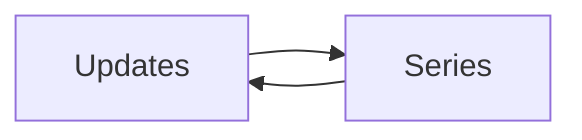
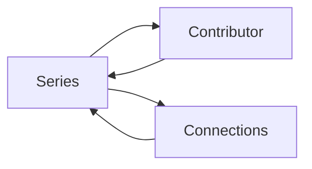
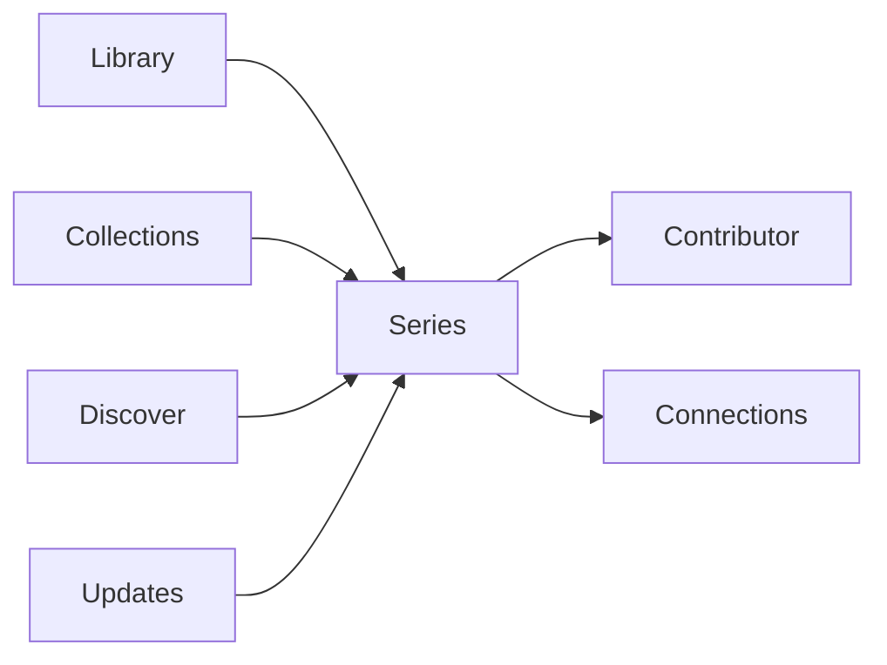

############################################################
## 08_LIBRARY.md
############################################################

# GLIV v2

# 08_LIBRARY.md

> Version: 2.0
> Status: Locked Design

## Purpose

The Library is GLIV's default screen and the center of the application.

It contains **only Titles you have started**.

## Views

- Grid (default)
- Shelf
- List

## Sorting

- Original Order
- Recently Added
- Alphabetical
- Last Updated
- Rating

## Filters

### Media

- Anime
- Manga
- Manhwa
- Manhua
- Novel

### Status

- Reading
- Watching
- Completed
- Paused
- Dropped

### Contributors

- Author
- Artist

### Metadata

- Genre

### Personal

- Collections
- Personal Tags
- Favorites

## Navigation



## Rules

- Only Titles you have started appear in the Library.
- Original Order is immutable.
- Fast editing should require no more than two clicks.
- Library displays personal data alongside provider-enriched information without allowing provider data to overwrite personal data.

############################################################
## 09_COLLECTIONS.md
############################################################

# GLIV v2

# 09_COLLECTIONS.md

> Version: 2.0
> Status: Locked Design

## Purpose

Collections allow you to organize Titles into personal groups independent of progress or status.

Collections are completely user-controlled and belong to Layer 1 (Personal Data).

---

## Collection Types

Examples include:

- Favorites
- Currently Reading
- Currently Watching
- Physical Collection
- Digital Collection
- Completed This Year
- Backlog
- Custom Collections

Users may create unlimited custom collections.

---

## Collection Information

Each Collection contains:

- Name
- Description (optional)
- Icon (optional)
- Color (optional)
- Creation Date
- Last Modified

---

## Collection Operations

Users can:

- Create Collections
- Rename Collections
- Delete Collections
- Reorder Collections
- Add Titles
- Remove Titles

Deleting a Collection never removes the Titles it contains.

---

## Navigation



---

## Rules

- A Title may belong to multiple Collections.
- Collections never affect progress or status.
- Collections are personal data and are never modified by providers.
- Collection order is user-controlled.
- Removing a Title from a Collection never removes it from the Library.

############################################################
## 10_DISCOVER.md
############################################################

# GLIV v2

# 10_DISCOVER.md

> Version: 2.0
> Status: Locked Design

## Purpose

Discover helps users find new Titles to add to their Library.

Discover combines provider-backed search with curated browsing while remaining clean, fast, and desktop-focused.

---

## Sections

- Universal Search
- Seasonal Anime
- Upcoming Anime
- Upcoming Adaptations
- Recommendations (Future)

---

## Universal Search

Universal Search searches supported providers through the Provider Manager.

Supported providers:

- AniList
- Jikan
- MangaUpdates
- Comick

Provider routing is automatic and transparent to the user.

---

## Search Results

Each result displays:

- Poster
- Title
- Media Type
- Current Status
- Brief Synopsis

Available actions:

- View Series
- Add to Library
- Add to Collection

---

## Manual Titles

If no supported provider returns a suitable result, users may create a Manual Title.

Manual Titles:

- are completely user-managed,
- do not synchronize with providers,
- do not receive live updates,
- do not calculate Effective Latest,
- remain fully functional for personal tracking.

---

## Seasonal Anime

Displays currently airing anime seasons.

Information includes:

- Poster
- Airing Status
- Episode Progress
- Release Schedule

---

## Upcoming Anime

Displays announced upcoming anime.

Information may include:

- Announcement
- Release Window
- Trailer
- Studio

---

## Upcoming Adaptations

Displays announced adaptations such as:

- Manga → Anime
- Novel → Anime
- Webtoon → Anime

---

## Search Flow



---

## Rules

- Discover never modifies personal data automatically.
- Provider selection is handled by the Provider Manager.
- Users always review provider-backed additions before they enter the Library.
- Manual Titles are only created when no suitable provider-backed result exists.

############################################################
## 11_UPDATES.md
############################################################

# GLIV v2

# 11_UPDATES.md

> Version: 2.0
> Status: Locked Design

## Purpose

Updates keep users informed about changes to Titles in their Library.

Only provider-backed Titles appear in Updates.

---

## Update Categories

### Releases

- New Anime Episode
- New Manga Chapter
- New Manhwa Chapter
- New Manhua Chapter
- New Novel Chapter
- Official English Release

### Publication

- Hiatus
- Hiatus Ended
- Serialization Completed
- License Announced

### Anime

- New Season
- Trailer Released
- Airing Started
- Airing Finished

### Adaptations

- Anime Announced
- Adaptation Confirmed
- Adaptation Released

---

## Update Card

Each update displays:

- Poster
- Title
- Update Type
- Description
- Date
- Quick Actions

Quick Actions:

- Open Series
- Mark Progress
- Dismiss

---

## Update Feed

Updates are shown in chronological order.

Users may filter by:

- Media Type
- Update Type
- Collection
- Favorites
- Date

---

## Manual Titles

Manual Titles do not appear in the Updates feed because they are not connected to provider data.

---

## Navigation



---

## Rules

- Updates never modify personal progress automatically.
- Updates are generated from provider-managed information.
- Dismissing an update never affects provider data.
- Manual Titles do not receive update notifications.

############################################################
## 12_SEARCH_SERIES.md
############################################################

# GLIV v2

# 12_SEARCH_SERIES.md

> Version: 2.0
> Status: Locked Design

## Purpose

The Series Page is the central information page for every Title.

It combines personal tracking with provider-managed metadata while keeping both clearly separated.

---

# Layout

```
---------------------------------------------------------
Header
---------------------------------------------------------

Poster

Title
Alternative Titles

Favorite
Rating

Quick Actions

---------------------------------------------------------
Format Cards
---------------------------------------------------------

Anime
Manga
Manhwa
Manhua
Novel

---------------------------------------------------------
Availability
---------------------------------------------------------

---------------------------------------------------------
Publication
---------------------------------------------------------

---------------------------------------------------------
Contributors
---------------------------------------------------------

Author
Artist

---------------------------------------------------------
Connections
---------------------------------------------------------

Prequel
Sequel
Continuation
Shared Universe
Adaptation
Original Source

---------------------------------------------------------
Synopsis

---------------------------------------------------------
Personal Notes
---------------------------------------------------------
```

---

# Header

Displays:

- Poster
- Primary Title
- Alternative Titles
- Favorite
- Rating
- Status
- Quick Actions

---

# Format Cards

Every Format has its own card.

Each card displays:

- Personal Progress
- Effective Latest (provider-backed Formats only)
- Progress Override (when present)
- Status
- Start Date
- Finish Date

Quick Actions:

- Edit Progress
- Edit Progress Override
- Change Status

Users may switch between Formats without leaving the Series Page.

---

# Availability

Displays provider-managed information such as:

- Official Platforms
- Official Publisher
- License Status
- Latest Official Release
- Latest Scanlation Release
- Scanlation Groups

Availability is informational only.

---

# Publication

Displays:

- Publication Status
- Start Date
- End Date
- Chapter Count
- Episode Count
- Volume Count

---

# Contributors

Displays Contributors grouped by role.

## Author

Selecting an Author opens the Contributor page showing:

- Biography (when available)
- Other Titles
- Titles in Your Library

## Artist

Selecting an Artist opens the Contributor page showing:

- Biography (when available)
- Other Titles
- Titles in Your Library

---

# Connections

Displays relationships between Titles.

Supported connection types:

- Prequel
- Sequel
- Continuation
- Shared Universe
- Adaptation
- Original Source

Author and Artist relationships are accessed through Contributor pages rather than Connections.

---

# Synopsis

Displays the provider synopsis.

---

# Personal Notes

Personal Notes are user-managed.

Provider synchronization never modifies them.

---

# Manual Titles

Manual Titles display only user-managed information.

Unavailable sections include:

- Availability
- Effective Latest
- Live publication updates

Manual Titles remain fully functional for:

- Progress
- Status
- Rating
- Favorite
- Notes
- Collections

---

# Navigation



---

# Rules

- Personal data is never overwritten by providers.
- Every Format maintains independent progress.
- Provider-backed Formats display Effective Latest.
- Progress Override applies per Format.
- Availability is a Series Page capability and not a navigation destination.
- Contributor pages replace Same Author and Same Artist connections.

############################################################
## 13_COMPONENT_MODEL.md
############################################################

# GLIV v2

# 13_COMPONENT_MODEL.md

> Version: 2.0
> Status: Locked Design

## Purpose

The Component Model defines the reusable user interface components used throughout GLIV.

Components should remain modular, reusable, and independent of business logic.

---

# Core Components

## Series Card

Displays:

- Poster
- Title
- Progress
- Status
- Rating
- Favorite

Used in:

- Library
- Collections
- Discover
- Contributor Pages

---

## Format Card

Displays information for a single Format.

Contents:

- Personal Progress
- Effective Latest (provider-backed Formats only)
- Progress Override
- Status
- Start Date
- Finish Date

Actions:

- Edit Progress
- Edit Progress Override
- Change Status

---

## Availability Panel

Displays:

- Official Platforms
- Official Publisher
- License Status
- Latest Official Release
- Latest Scanlation Release
- Scanlation Groups

Hidden for Manual Titles.

---

## Publication Panel

Displays:

- Publication Status
- Start Date
- End Date
- Chapter Count
- Episode Count
- Volume Count

---

## Contributor Card

Displays:

- Contributor Name
- Role (Author / Artist)
- Portrait (when available)

Selecting a Contributor opens the Contributor page.

---

## Connections Panel

Displays:

- Prequel
- Sequel
- Continuation
- Shared Universe
- Adaptation
- Original Source

---

## Synopsis Panel

Displays the provider synopsis.

---

## Notes Panel

Displays personal notes.

Editable by the user.

---

## Rating Component

Allows users to rate a Title.

Rating is personal data.

---

## Favorite Toggle

Allows users to mark or unmark a Title as a Favorite.

Favorites are personal data.

---

## Progress Override Control

Available only for provider-backed Formats.

Allows users to:

- Create a Progress Override
- Edit a Progress Override
- Remove a Progress Override

---

## Manual Title Information Panel

Displayed when the currently selected Format is a Manual Format.

Explains that the following features are unavailable:

- Provider synchronization
- Availability
- Effective Latest
- Live updates

---

# Principles

- Components remain reusable.
- Components do not contain business logic.
- Personal data components never depend on provider data.
- Provider-backed and Manual Title components remain visually consistent where possible.

############################################################
## 14_NAVIGATION.md
############################################################

# GLIV v2

# 14_NAVIGATION.md

> Version: 2.0
> Status: Locked Design

## Primary Navigation



## Primary Destinations

The main application navigation consists of:

- Library
- Collections
- Discover
- Updates
- Settings

Availability is accessed from the Series Page and is not a navigation destination.

## Secondary Navigation

The following pages are reached from a Series Page and never appear in the primary sidebar:

- Contributor
- Connections

Contributor pages display the series associated with the selected Contributor.

## Navigation Rules

- Library is the default landing page.
- Every common action should require no more than two clicks.
- Context is preserved when returning from Series Pages.
- Secondary pages never appear in the primary sidebar.
- Availability is a Series Page capability rather than a navigation destination.

############################################################
## 15_WIREFRAMES.md
############################################################

# GLIV v2

# 15_WIREFRAMES.md

> Version: 2.0
> Status: Locked Design

---

# Library

```
----------------------------------------------------------

Search

Filters

----------------------------------------------------------

Poster   Title

Progress

Status

Rating ★

Favorite ♥

----------------------------------------------------------
```

---

# Collections

```
----------------------------------------------------------

Collections

----------------------------------------------------------

Favorites

Currently Reading

Physical Collection

Custom Collections

----------------------------------------------------------
```

---

# Discover

```
----------------------------------------------------------

Search

----------------------------------------------------------

Poster

Title

Media Type

Status

Synopsis

[ View Series ]

[ Add to Library ]

----------------------------------------------------------

No suitable result?

[ Create Manual Title ]

----------------------------------------------------------
```

---

# Updates

```
----------------------------------------------------------

Poster

Title

Update Type

Date

[ Open ]

[ Mark Progress ]

----------------------------------------------------------
```

---

# Series Page

```
----------------------------------------------------------

Poster

Title

Alternative Titles

Favorite ♥

Rating ★

Status

----------------------------------------------------------

FORMAT TABS

Anime | Manga | Manhwa | Manhua | Novel

[ + Add Another Format ]

----------------------------------------------------------

Progress

210 / 223

[ Edit Progress ]

[ Progress Override ]

----------------------------------------------------------

Availability

Official Platforms

Official Publisher

Latest Official

Latest Scanlation

Scanlation Groups

----------------------------------------------------------

Publication

Status

Volumes

Chapters

----------------------------------------------------------

Contributors

Author

Artist

----------------------------------------------------------

Connections

Prequel

Sequel

Continuation

Shared Universe

Adaptation

Original Source

----------------------------------------------------------

Synopsis

----------------------------------------------------------

Personal Notes

----------------------------------------------------------
```

---

# Manual Title

```
----------------------------------------------------------

Poster

Title

Favorite ♥

Rating ★

Status

----------------------------------------------------------

FORMAT

Anime | Manga | Manhwa | Manhua | Novel

----------------------------------------------------------

Progress

210

----------------------------------------------------------

This Format is not linked to a supported provider.

Provider synchronization,
Availability,
Effective Latest,
Progress Override,
and Live Updates
are unavailable for this Format.

----------------------------------------------------------

Personal Notes

----------------------------------------------------------
```

---

# Contributor Page

```
----------------------------------------------------------

Contributor

Biography

----------------------------------------------------------

Titles in Your Library

----------------------------------------------------------

Other Titles

----------------------------------------------------------
```

---

# Principles

- Wireframes illustrate structure rather than final visual design.
- Provider-backed Titles and Manual Titles have distinct layouts.
- Availability appears only for provider-backed Titles.
- Contributors replace separate Author and Artist pages while remaining grouped by role.

############################################################
## 22_UI_DESIGN_SYSTEM.md
############################################################

# GLIV v2

# 22_UI_DESIGN_SYSTEM.md

> Version: 2.0
> Status: Locked Design

## Philosophy

GLIV should feel calm, premium, and desktop-first.

The interface should prioritize clarity, information density, and consistency over decoration.

---

## Principles

- Desktop-first
- Offline-first
- Minimal visual clutter
- Fast interaction
- Consistent layouts
- Readability over decoration

---

## Layout

The application follows a consistent structure:

- Primary Navigation
- Main Content Area
- Context Panels
- Dialogs

The layout should remain stable across the application.

---

## Visual Hierarchy

Information is presented in the following order:

1. Personal Information
2. Provider Information
3. Supporting Metadata

Personal information should always receive visual priority.

---

## Colors

Colors communicate meaning rather than decoration.

Examples:

- Progress
- Status
- Availability
- Notifications
- Errors

Colors should remain consistent throughout the application.

---

## Typography

Typography should emphasize readability.

Hierarchy:

- Page Titles
- Section Titles
- Body Text
- Supporting Information

Avoid unnecessary font variations.

---

## Icons

Icons supplement labels rather than replace them.

Icons should remain consistent throughout the application.

---

## Cards

Cards are the primary reusable presentation unit.

Examples:

- Series Card
- Format Card
- Contributor Card
- Update Card

Cards should share consistent spacing and alignment.

---

## Dialogs

Dialogs should:

- focus on one task,
- provide clear confirmation actions,
- avoid unnecessary complexity.

---

## Empty States

Empty states should:

- explain why content is unavailable,
- guide the user toward the next action,
- avoid feeling like an error.

---

## Responsiveness

GLIV is optimized for desktop environments.

Layouts should gracefully adapt to different desktop window sizes without changing the overall navigation model.

---

## Principles

- Consistency over novelty.
- Personal information always receives visual priority.
- Provider-backed information should remain clearly distinguishable from personal data.
- Components should remain visually consistent throughout the application.

############################################################
## 43_FILTER_SYSTEM_SPECIFICATION.md
############################################################

# GLIV v2

# 43_FILTER_SYSTEM_SPECIFICATION.md

> Version: 2.0
> Status: Locked Design

## Purpose

The Filter System allows users to quickly narrow displayed Titles throughout GLIV.

Filtering should remain fast, consistent, and reusable across all application sections.

---

# Filter Categories

## Media

- Anime
- Manga
- Manhwa
- Manhua
- Novel

---

## Status

- Watching
- Reading
- Completed
- Paused
- Dropped
- Planning

---

## Personal

- Rating
- Favorites
- Collections
- Personal Tags

---

## Contributors

- Author
- Artist

---

## Metadata

- Genre
- Studio
- Publication Status

---

## Availability

- Officially Available
- Licensed
- Hiatus

Availability filters apply only to provider-backed Titles.

---

## Date

- Recently Added
- Recently Updated
- Release Date

---

# Excluded Filters

Content rating and maturity/age filtering are intentionally not implemented in v1. All results — personal Library and provider-backed — are shown without restriction.

This is a deliberate decision recorded in 21_SEARCH_ENGINE.md, not an omission. A future coding agent or contributor must not add a rating/maturity filter, toggle, or default-hidden content behavior without a new decision record.

---

# Filter Behavior

- Multiple filters may be combined.
- Filters update results immediately.
- Active filters remain visible.
- Users can clear all filters with a single action.

---

# Search Integration

Search and Filters work together.

Users may search first, filter first, or combine both.

---

# Principles

- Filtering never modifies data.
- Filter behavior remains consistent throughout the application.
- Personal filters operate on Layer 1 data.
- Provider-backed filters operate on provider-managed information.

############################################################
## 44_DIALOG_SYSTEM_SPECIFICATION.md
############################################################

# GLIV v2

# 44_DIALOG_SYSTEM_SPECIFICATION.md

> Version: 2.0
> Status: Locked Design

## Purpose

Dialogs allow users to perform focused tasks without leaving their current context.

Every dialog should present a single clear action and minimize unnecessary decisions.

---

# Edit Progress

Allows users to update personal progress.

Displays:

- Current Progress
- New Progress
- Status (optional)

Actions:

- Save
- Cancel

---

# Progress Override

Available only for provider-backed Formats.

Allows users to:

- Create a Progress Override
- Edit an existing Progress Override
- Remove a Progress Override

Displays:

- Current Effective Latest
- Override Value
- Explanation of Progress Override

Actions:

- Save
- Remove Override
- Cancel

Removing a Progress Override immediately restores the provider-calculated Effective Latest.

---

# Import Review

Displayed whenever provider-backed imports require user confirmation.

Displays:

- Import candidate
- Existing library match (if applicable)
- Suggested action
- Match confidence

Actions:

- Merge
- Create New Title
- Create Manual Title
- Search Again
- Skip

Import Review is required for all non-deterministic provider matches.

---

# Confirmation Dialog

Used for destructive actions.

Examples:

- Delete Collection
- Remove Title
- Delete Notes
- Clear Progress Override

Actions:

- Confirm
- Cancel

---

# Merge Titles

Allows users to merge duplicate Titles.

Displays:

- Source Title
- Target Title
- Merge Summary

Actions:

- Merge
- Cancel

---

# Backup Restore

Shown before restoring a backup.

Displays:

- Backup Date
- Backup Version
- Items to Restore

Actions:

- Restore
- Cancel

---

# Error Dialog

Displays recoverable errors.

Examples:

- Provider unavailable
- Import failed
- Backup failed

Actions should always provide a clear recovery path when possible.

---

# Principles

- Dialogs perform one task only.
- Dialogs never hide important consequences.
- Destructive actions always require confirmation.
- Personal data changes are always initiated by the user.
- Dialogs should preserve the user's context whenever possible.

############################################################
## 50_KEYBOARD_SHORTCUTS.md
############################################################

# GLIV v2

# 50_KEYBOARD_SHORTCUTS.md

> Version: 2.0
> Status: Locked Design

## Purpose

Keyboard shortcuts provide fast navigation and efficient interaction throughout GLIV.

All shortcuts should remain consistent, discoverable, and optional.

---

# Global

| Shortcut | Action |
|-----------|--------|
| Ctrl + F | Universal Search |
| Ctrl + N | Create Collection |
| Ctrl + S | Save |
| Ctrl + , | Settings |
| F5 | Refresh Provider Data |

---

# Library

| Shortcut | Action |
|-----------|--------|
| Enter | Open Selected Series |
| Delete | Remove from Collection |
| Ctrl + E | Edit Progress |
| Ctrl + R | Edit Rating |
| Ctrl + D | Toggle Favorite |

---

# Series Page

| Shortcut | Action |
|-----------|--------|
| Ctrl + E | Edit Progress |
| Ctrl + O | Edit Progress Override |
| Ctrl + N | Edit Notes |
| Esc | Close Dialog |

---

# Navigation

| Shortcut | Action |
|-----------|--------|
| Alt + 1 | Library |
| Alt + 2 | Collections |
| Alt + 3 | Discover |
| Alt + 4 | Updates |
| Alt + 5 | Settings |

---

# Principles

- Every shortcut should have an equivalent mouse interaction.
- Keyboard shortcuts should never be required to use GLIV.
- Shortcuts should remain consistent throughout the application.
- Destructive actions should always require confirmation.

############################################################
## 51_ANIMATION_GUIDELINES.md
############################################################

# GLIV v2

# 51_ANIMATION_GUIDELINES.md

> Version: 2.0
> Status: Locked Design

## Purpose

Animations should enhance usability by providing feedback and continuity without distracting from the user's workflow.

GLIV prioritizes responsiveness and clarity over visual effects.

---

# Principles

- Fast
- Subtle
- Consistent
- Purposeful

Animations should always communicate state changes rather than serve as decoration.

---

# Navigation

Use subtle transitions when navigating between:

- Library
- Collections
- Discover
- Updates
- Series Pages

Navigation should always feel immediate.

---

# Lists

List updates should animate gently when:

- Adding Titles
- Removing Titles
- Reordering Collections
- Applying Filters

Animations should never delay interaction.

---

# Dialogs

Dialogs should:

- Fade in quickly
- Fade out quickly
- Preserve user context

Dialog animations should remain short and unobtrusive.

---

# Loading

Loading indicators should:

- Appear immediately
- Disappear smoothly
- Avoid excessive motion

Whenever possible, use skeleton placeholders instead of long loading animations.

---

# Feedback

Provide subtle animation feedback for:

- Successful saves
- Progress updates
- Favorite toggles
- Rating changes

Feedback should reinforce the completed action without interrupting the workflow.

---

# Accessibility

Animations should respect the operating system's reduced motion preference.

When reduced motion is enabled, non-essential animations should be disabled.

---

# Principles

- Animations should never block user interaction.
- Motion should support understanding, not decoration.
- Consistency is more important than visual complexity.
- Accessibility always takes priority over animation.

############################################################
## 52_EMPTY_STATES.md
############################################################

# GLIV v2

# 52_EMPTY_STATES.md

> Version: 2.0
> Status: Locked Design

## Purpose

Empty States explain why content is unavailable and guide users toward the next appropriate action.

An empty state should always be informative, reassuring, and actionable.

---

# Empty Library

Message:

> Your Library is empty.

Actions:

- Discover Titles
- Import Library
- Create Manual Title

---

# Empty Collection

Message:

> This Collection doesn't contain any Titles yet.

Actions:

- Browse Library
- Add Titles

---

# No Search Results

Message:

> No matching Titles were found.

Actions:

- Refine Search
- Create Manual Title

---

# Empty Updates

Message:

> You're completely up to date.

Actions:

- Open Library
- Discover Titles

---

# Manual Title Information

Displayed for Manual Titles.

Message:

> This Title is managed entirely by you.

Unavailable features:

- Provider synchronization
- Availability
- Effective Latest
- Live updates

Available features:

- Personal Progress
- Status
- Rating
- Favorite
- Notes
- Collections

---

# Provider Unavailable

Message:

> Provider information is temporarily unavailable.

Actions:

- Retry
- Continue Offline

Personal information remains fully available.

---

# Empty Contributor

Message:

> No additional Titles are available for this Contributor.

Actions:

- Return to Library
- Discover Titles

---

# Principles

- Every empty state explains why content is unavailable.
- Every empty state provides a clear next action.
- Empty states should never feel like errors.
- Personal data remains accessible even when provider information is unavailable.

############################################################
## 53_ERROR_HANDLING.md
############################################################

# GLIV v2

# 53_ERROR_HANDLING.md

> Version: 2.0
> Status: Locked Design

## Purpose

Error handling should clearly explain what happened, why it happened (when appropriate), and how the user can recover.

Errors should never place personal data at risk.

---

# Error Categories

## Provider Errors

Examples:

- Provider unavailable
- Request timeout
- Invalid provider response

Recovery:

- Retry
- Continue Offline

Personal data remains fully available.

---

## Import Errors

Examples:

- Unsupported import format
- Invalid import data
- Import cancelled

Recovery:

- Retry Import
- Review Import
- Cancel

---

## Synchronization Errors

Examples:

- Sync interrupted
- Provider temporarily unavailable

Recovery:

- Retry Sync
- Continue Offline

Synchronization failures never modify personal data.

---

## Database Errors

Examples:

- Database unavailable
- Database corruption
- Migration failure

Recovery:

- Restore Backup
- Retry
- Contact Support (Future)

---

## Backup Errors

Examples:

- Backup failed
- Restore failed
- Backup incompatible

Recovery:

- Retry
- Select another Backup

---

## Validation Errors

Examples:

- Required field missing
- Invalid value
- Duplicate entry

Validation should identify the affected field whenever possible.

---

## Principles

- Personal data must never be lost because of an error.
- Every error should provide a recovery path.
- Technical details should remain hidden unless needed for troubleshooting.
- Provider failures should never block access to personal data.
- Error messages should be clear, concise, and actionable.

############################################################
## 54_ACCESSIBILITY.md
############################################################

# GLIV v2

# 54_ACCESSIBILITY.md

> Version: 2.0
> Status: Locked Design

## Purpose

Accessibility ensures GLIV remains usable for as many users as possible without compromising the desktop-first experience.

Accessibility should be considered throughout the application rather than added afterward.

---

# Keyboard Navigation

Every interactive element must be reachable using the keyboard.

Users should be able to:

- Navigate
- Select
- Edit
- Confirm
- Cancel

without requiring a mouse.

---

# Focus

The currently focused element must always be visually distinguishable.

Focus order should follow the visual layout of the application.

---

# Contrast

Text, icons, and interactive controls should provide sufficient contrast for comfortable reading.

Color should never be the only indicator of meaning.

---

# Typography

Typography should prioritize readability.

Guidelines:

- Clear hierarchy
- Consistent sizing
- Comfortable spacing
- Avoid unnecessary font variations

---

# Icons

Icons should always be accompanied by descriptive labels or tooltips.

Icons should enhance recognition rather than replace text.

---

# Dialogs

Dialogs should:

- Receive keyboard focus when opened.
- Trap focus until closed.
- Support keyboard confirmation and cancellation.
- Return focus to the originating control when closed.

---

# Animations

Animations should respect the operating system's reduced motion preference.

Users who disable motion should still receive clear visual feedback.

---

# Error Messages

Error messages should:

- Clearly explain the problem.
- Identify the affected field when appropriate.
- Suggest a recovery action.

Errors should never rely solely on color to communicate meaning.

---

# Principles

- Accessibility is part of the core design, not an optional feature.
- Every feature should remain usable with keyboard navigation.
- Readability always takes priority over decoration.
- Accessibility improvements should never reduce functionality.

############################################################
## 62_DISCOVER_FILTERS.md
############################################################

# GLIV v2

# 62_DISCOVER_FILTERS.md

> Version: 2.0
> Status: Locked Design

## Purpose

Discover Filters help users narrow search and browsing results without affecting personal library data.

Filters operate only on provider-backed search results.

---

# Media Type

- Anime
- Manga
- Manhwa
- Manhua
- Novel

---

# Status

- Airing
- Finished
- Publishing
- Completed
- Upcoming
- Hiatus

---

# Genres

Users may filter by one or more genres.

---

# Year

Filter by:

- Release Year
- Season (Anime)

---

# Publication

Filter by:

- Licensed
- Officially Available
- Adaptation Available

---

# Search Integration

Discover Filters work together with Universal Search.

Users may:

- Search only
- Filter only
- Combine Search and Filters

---

# Results

Filtering updates search results immediately.

Changing filters never modifies personal library data.

---

# Principles

- Filters never modify data.
- Multiple filters may be combined.
- Active filters remain visible.
- Users can clear all filters with a single action.
- Provider routing remains transparent to the user.

