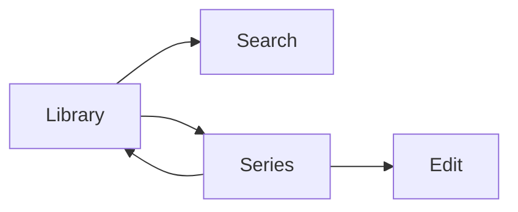

# GLIV v2

# 08_LIBRARY.md

> Version: 2.0
> Status: Locked Design

## Purpose

The Library is GLIV's default screen and the center of the application.

It contains **only Titles you have started**.

## Views

- Grid (default)
- Shelf
- List

## Sorting

- Original Order
- Recently Added
- Alphabetical
- Last Updated
- Rating

## Filters

### Media

- Anime
- Manga
- Manhwa
- Manhua
- Novel

### Status

- Reading
- Watching
- Completed
- Paused
- Dropped

### Contributors

- Author
- Artist

### Metadata

- Genre

### Personal

- Collections
- Personal Tags
- Favorites

## Navigation

## Rules

- Only Titles you have started appear in the Library.
- Original Order is immutable.
- Fast editing should require no more than two clicks.
- Library displays personal data alongside provider-enriched information without allowing provider data to overwrite personal data.