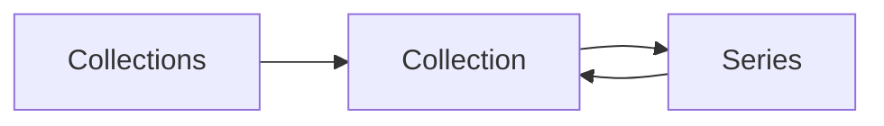

# GLIV v2

# 09_COLLECTIONS.md

> Version: 2.0
> Status: Locked Design

## Purpose

Collections allow you to organize Titles into personal groups independent of progress or status.

Collections are completely user-controlled and belong to Layer 1 (Personal Data).

---

## Collection Types

Examples include:

- Favorites
- Currently Reading
- Currently Watching
- Physical Collection
- Digital Collection
- Completed This Year
- Backlog
- Custom Collections

Users may create unlimited custom collections.

---

## Collection Information

Each Collection contains:

- Name
- Description (optional)
- Icon (optional)
- Color (optional)
- Creation Date
- Last Modified

---

## Collection Operations

Users can:

- Create Collections
- Rename Collections
- Delete Collections
- Reorder Collections
- Add Titles
- Remove Titles

Deleting a Collection never removes the Titles it contains.

---

## Navigation

---

## Rules

- A Title may belong to multiple Collections.
- Collections never affect progress or status.
- Collections are personal data and are never modified by providers.
- Collection order is user-controlled.
- Removing a Title from a Collection never removes it from the Library.