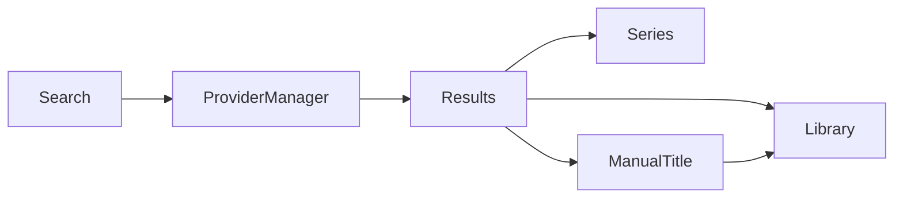

# GLIV v2

# 10_DISCOVER.md

> Version: 2.0
> Status: Locked Design

## Purpose

Discover helps users find new Titles to add to their Library.

Discover combines provider-backed search with curated browsing while remaining clean, fast, and desktop-focused.

---

## Sections

- Universal Search
- Seasonal Anime
- Upcoming Anime
- Upcoming Adaptations
- Recommendations (Future)

---

## Universal Search

Universal Search searches supported providers through the Provider Manager.

Supported providers:

- AniList
- Jikan
- MangaUpdates
- Comick

Provider routing is automatic and transparent to the user.

---

## Search Results

Each result displays:

- Poster
- Title
- Media Type
- Current Status
- Brief Synopsis

Available actions:

- View Series
- Add to Library
- Add to Collection

---

## Manual Titles

If no supported provider returns a suitable result, users may create a Manual Title.

Manual Titles:

- are completely user-managed,
- do not synchronize with providers,
- do not receive live updates,
- do not calculate Effective Latest,
- remain fully functional for personal tracking.

---

## Seasonal Anime

Displays currently airing anime seasons.

Information includes:

- Poster
- Airing Status
- Episode Progress
- Release Schedule

---

## Upcoming Anime

Displays announced upcoming anime.

Information may include:

- Announcement
- Release Window
- Trailer
- Studio

---

## Upcoming Adaptations

Displays announced adaptations such as:

- Manga → Anime
- Novel → Anime
- Webtoon → Anime

---

## Search Flow

---

## Rules

- Discover never modifies personal data automatically.
- Provider selection is handled by the Provider Manager.
- Users always review provider-backed additions before they enter the Library.
- Manual Titles are only created when no suitable provider-backed result exists.