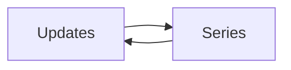

# GLIV v2

# 11_UPDATES.md

> Version: 2.0
> Status: Locked Design

## Purpose

Updates keep users informed about changes to Titles in their Library.

Only provider-backed Titles appear in Updates.

---

## Update Categories

### Releases

- New Anime Episode
- New Manga Chapter
- New Manhwa Chapter
- New Manhua Chapter
- New Novel Chapter
- Official English Release

### Publication

- Hiatus
- Hiatus Ended
- Serialization Completed
- License Announced

### Anime

- New Season
- Trailer Released
- Airing Started
- Airing Finished

### Adaptations

- Anime Announced
- Adaptation Confirmed
- Adaptation Released

---

## Update Card

Each update displays:

- Poster
- Title
- Update Type
- Description
- Date
- Quick Actions

Quick Actions:

- Open Series
- Mark Progress
- Dismiss

---

## Update Feed

Updates are shown in chronological order.

Users may filter by:

- Media Type
- Update Type
- Collection
- Favorites
- Date

---

## Manual Titles

Manual Titles do not appear in the Updates feed because they are not connected to provider data.

---

## Navigation

---

## Rules

- Updates never modify personal progress automatically.
- Updates are generated from provider-managed information.
- Dismissing an update never affects provider data.
- Manual Titles do not receive update notifications.