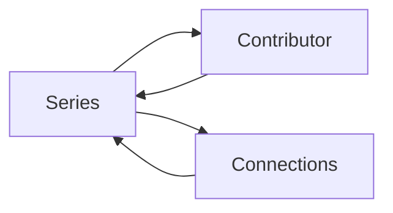

# GLIV v2

# 12_SEARCH_SERIES.md

> Version: 2.0
> Status: Locked Design

## Purpose

The Series Page is the central information page for every Title.

It combines personal tracking with provider-managed metadata while keeping both clearly separated.

---

# Layout

```
---------------------------------------------------------
Header
---------------------------------------------------------

Poster

Title
Alternative Titles

Favorite
Rating

Quick Actions

---------------------------------------------------------
Format Cards
---------------------------------------------------------

Anime
Manga
Manhwa
Manhua
Novel

---------------------------------------------------------
Availability
---------------------------------------------------------

---------------------------------------------------------
Publication
---------------------------------------------------------

---------------------------------------------------------
Contributors
---------------------------------------------------------

Author
Artist

---------------------------------------------------------
Connections
---------------------------------------------------------

Prequel
Sequel
Continuation
Shared Universe
Adaptation
Original Source

---------------------------------------------------------
Synopsis

---------------------------------------------------------
Personal Notes
---------------------------------------------------------
```

---

# Header

Displays:

- Poster
- Primary Title
- Alternative Titles
- Favorite
- Rating
- Status
- Quick Actions

---

# Format Cards

Every Format has its own card.

Each card displays:

- Personal Progress
- Effective Latest (provider-backed Formats only)
- Progress Override (when present)
- Status
- Start Date
- Finish Date

Quick Actions:

- Edit Progress
- Edit Progress Override
- Change Status

Users may switch between Formats without leaving the Series Page.

---

# Availability

Displays provider-managed information such as:

- Official Platforms
- Official Publisher
- License Status
- Latest Official Release
- Latest Scanlation Release
- Scanlation Groups

Availability is informational only.

---

# Publication

Displays:

- Publication Status
- Start Date
- End Date
- Chapter Count
- Episode Count
- Volume Count

---

# Contributors

Displays Contributors grouped by role.

## Author

Selecting an Author opens the Contributor page showing:

- Biography (when available)
- Other Titles
- Titles in Your Library

## Artist

Selecting an Artist opens the Contributor page showing:

- Biography (when available)
- Other Titles
- Titles in Your Library

---

# Connections

Displays relationships between Titles.

Supported connection types:

- Prequel
- Sequel
- Continuation
- Shared Universe
- Adaptation
- Original Source

Author and Artist relationships are accessed through Contributor pages rather than Connections.

---

# Synopsis

Displays the provider synopsis.

---

# Personal Notes

Personal Notes are user-managed.

Provider synchronization never modifies them.

---

# Manual Titles

Manual Titles display only user-managed information.

Unavailable sections include:

- Availability
- Effective Latest
- Live publication updates

Manual Titles remain fully functional for:

- Progress
- Status
- Rating
- Favorite
- Notes
- Collections

---

# Navigation



---

# Rules

- Personal data is never overwritten by providers.
- Every Format maintains independent progress.
- Provider-backed Formats display Effective Latest.
- Progress Override applies per Format.
- Availability is a Series Page capability and not a navigation destination.
- Contributor pages replace Same Author and Same Artist connections.