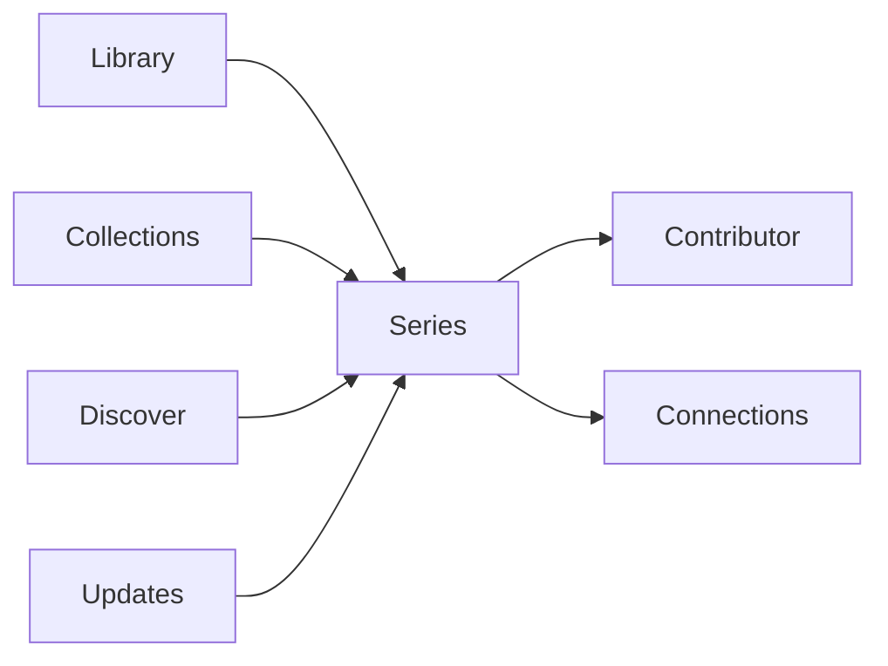

# GLIV v2

# 14_NAVIGATION.md

> Version: 2.0
> Status: Locked Design

## Primary Navigation

## Primary Destinations

The main application navigation consists of:

- Library
- Collections
- Discover
- Updates
- Settings

Availability is accessed from the Series Page and is not a navigation destination.

## Secondary Navigation

The following pages are reached from a Series Page and never appear in the primary sidebar:

- Contributor
- Connections

Contributor pages display the series associated with the selected Contributor.

## Navigation Rules

- Library is the default landing page.
- Every common action should require no more than two clicks.
- Context is preserved when returning from Series Pages.
- Secondary pages never appear in the primary sidebar.
- Availability is a Series Page capability rather than a navigation destination.